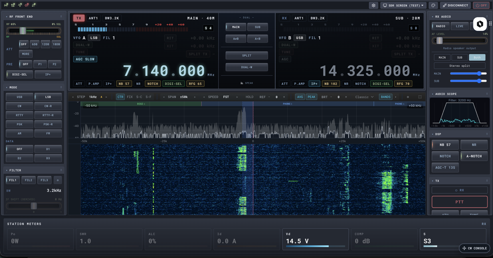
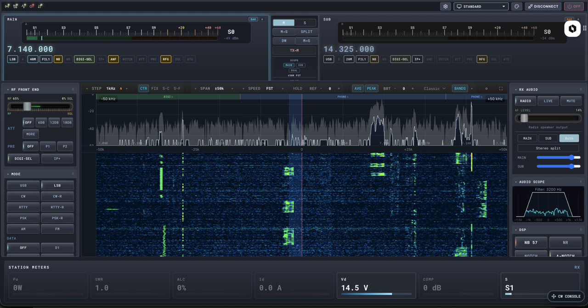
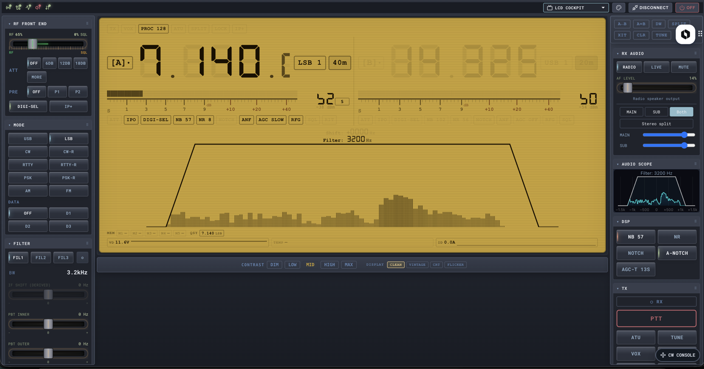

# rigplane

[](https://pypi.org/project/rigplane/)
[](https://www.python.org/downloads/)
[](https://github.com/rigplane/rigplane-core/actions/workflows/test.yml)
[](https://rigplane.dev)
[](LICENSE)

> **v2.0.0 — renamed from `icom-lan`.** The package, console script, repo,
> and docs now ship as `rigplane`. Existing `from icom_lan import ...` calls
> keep working through a deprecation shim. Migration guide:
> [rigplane.dev/migrate](https://rigplane.dev/migrate).

**rigplane** is a multi-vendor radio control library and Web UI — Python
asyncio core plus a self-contained browser front-end. It speaks Icom CI-V
(LAN UDP and USB), Yaesu CAT, and Kenwood-style CAT, with stable backends
for IC-7610, IC-7300, and Yaesu FTX-1, and profile-based support for IC-705,
IC-9700, Xiegu X6100, and Lab599 TX-500. Direct connection to your radio:
no wfview, no hamlib daemon, no RS-BA1. A capability-driven runtime renders
the same Web UI and `rigctld`-compatible network bridge across every backend
that honours the public `Radio` protocol. Tested in production against
WSJT-X, fldigi, and JS8Call.

<p align="center">
  
</p>

## Quickstart

```bash
pip install rigplane
rigplane web                # auto-discovers a radio on the LAN
# open http://localhost:8080
```

Or as a library:

```python
import asyncio
from rigplane import create_radio, LanBackendConfig

async def main():
    async with create_radio(LanBackendConfig(host="192.168.1.100",
                                             username="user",
                                             password="pass")) as radio:
        await radio.set_frequency(14_074_000)
        await radio.set_mode("USB")
        print(await radio.get_s_meter())

asyncio.run(main())
```

Full guides: [getting started](https://rigplane.dev/guide/quickstart/),
[CLI](https://rigplane.dev/guide/cli/),
[public API surface](https://rigplane.dev/api/public-api-surface/).

## Supported radios

| Radio              | Transport          | Status              | Notes                                  |
|--------------------|--------------------|---------------------|----------------------------------------|
| **Icom IC-7610**   | LAN, USB CI-V      | Stable, primary     | Dual receiver MAIN/SUB, full Capability surface |
| **Icom IC-7300**   | USB CI-V           | Stable              | Single receiver, USB-only              |
| **Yaesu FTX-1**    | USB CAT            | Stable              | 17 modes, VHF/UHF, C4FM, audio FFT scope |
| Icom IC-705        | LAN (WiFi)         | Community-validated | CI-V `0xA4`                            |
| Icom IC-9700       | LAN, USB CI-V      | Profile only        | VHF/UHF/SHF                            |
| Xiegu X6100        | USB CI-V           | Profile only        | IC-705 compatible, QRP                 |
| Lab599 TX-500      | USB Kenwood CAT    | Profile only        | QRP, minimal CAT                       |

Radio capabilities are declared in `rigs/*.toml` — adding a new model is
typically a profile change, not Python code. Three protocol families are
supported: CI-V (Icom binary), Kenwood CAT (text), Yaesu CAT (text). See
[adding a new radio](https://rigplane.dev/guide/rig-profiles/).

## Why 1.0

- **Public API stability commitment.** The Tier 1 surface — the `Radio`
  protocol, the capability protocols (`AudioCapable`, `ScopeCapable`,
  `MetersCapable`, `LevelsCapable`, `StatePollable`, `RigctldRoutable`,
  `UsbAudioCapable`, …), `create_radio` / `BackendConfig`, and the
  `local-extensions/` host API — is now under SemVer. See
  [`docs/api/public-api-surface.md`](docs/api/public-api-surface.md).
- **Capability-driven multi-radio architecture.** Implement the relevant
  Capability Protocols and your backend slots into the runtime, Web UI,
  and rigctld layers without any of those layers knowing about your
  radio. See [`ARCHITECTURE.md`](ARCHITECTURE.md).
- **5,600+ unit tests.** `import-linter` enforces 11-layer package
  boundaries; mypy is clean across the public surface; ruff lints in CI.
- **Verified against the digital-mode ecosystem.** WSJT-X, fldigi, and
  JS8Call golden-replay tests pass over the rigctld bridge with full
  per-VFO routing.

## Web UI

`rigplane web` boots a self-contained HTTP + WebSocket server. The frontend
is a Svelte 5 single-page app served from the same process; no native
shell, no Electron, no Tauri — just a browser tab.

Four user-facing skins resolve from `frontend/src/skins/registry.ts`:

- **Desktop v2** — default skin: dual-RX VFO, scope + waterfall, meters
  dock, control panels.
- **LCD Scope** — alternative dual-RX layout with vintage-LCD typography
  and the same scope + meters dock.
- **LCD Cockpit** — single-RX or dual-cockpit variants with retro LCD
  styling, telemetry strip, AmberScope (also resolves under the legacy
  `amber-lcd` alias).
- **Mobile** — chip-scroll IA, persistent guarded PTT FAB, container-query
  responsive layout.

<p align="center">
  
  
</p>

<!-- SCREENSHOT: Mobile skin — ESSENTIALS panel + PTT FAB (TBD, pending device) -->

## Architecture

`src/rigplane/` is organised into 11 layered Python packages
(`core/`, `commands/`, `profiles/`, `audio/`, `scope/`, `dsp/`,
`runtime/`, `backends/`, `web/`, `rigctld/`, `cli/`) with explicit
boundaries enforced by `import-linter`. Higher layers depend on lower
ones; siblings are independent. See [`ARCHITECTURE.md`](ARCHITECTURE.md)
for the layout and per-layer charters in `src/rigplane/<layer>/LAYER.md`.

Extensibility is centred on **Capability Protocols** in
`rigplane.radio_protocol`. A new backend implements the protocols it
supports; consumers (Web UI, rigctld, CLI, third-party scripts) feature-detect
via `isinstance(radio, ScopeCapable)` and never branch on backend identity.
The `Radio` protocol plus the capability suite is the **stable contract**
between the open core and downstream consumers.

The frontend extension surface lives at
[`frontend/src/lib/local-extensions/`](frontend/src/lib/local-extensions/) —
a Tier 1 contract for embedders shipping panels, dock items, or keyboard
scopes into the open-core shell.

## Documentation

- [Quickstart](https://rigplane.dev/guide/quickstart/)
- [CLI reference](https://rigplane.dev/guide/cli/)
- [Public API surface (Tier 1 stability)](docs/api/public-api-surface.md)
- [Adding a new radio (TOML profiles)](https://rigplane.dev/guide/rig-profiles/)
- [Architecture overview](ARCHITECTURE.md)
- [Open-core policy](docs/architecture/open-core-policy.md)
- [Diagnostic reports guide](docs/guide/diagnostic-reports.md) — how to send a one-click bug report when you hit an issue.
- [Protocol internals](https://rigplane.dev/internals/protocol/)
- [Security](docs/SECURITY.md)

## License

MIT — see [LICENSE](LICENSE). Protocol knowledge derived from the
[wfview](https://wfview.org/) project's reverse-engineering work; this is
an independent clean-room implementation, not a derivative of wfview's
GPLv3 code. Icom™ and IC-* product names are registered trademarks of
[Icom Incorporated](https://www.icomjapan.com/), used here for nominative
fair-use compatibility identification only — this project is not affiliated
with, endorsed by, or sponsored by Icom.

rigplane is the **open-core** half of a planned product split. A
proprietary commercial layer (`rigplane-pro`) is under active development
and will integrate with this library through the public `Radio` protocol
and the `local-extensions/` host API. Open-core constraints — no
telemetry, headless mode is sacred, no hollowing out — are codified in
[`docs/architecture/open-core-policy.md`](docs/architecture/open-core-policy.md).

## Status

KN4KYD's personal project. Production-grade for IC-7610 (the author's
daily driver) and the Yaesu FTX-1; secondary radios are validated against
the same Capability Protocols but receive less hardware-in-the-loop time.
Issues, profile contributions, and field reports are welcome.

73 de KN4KYD
