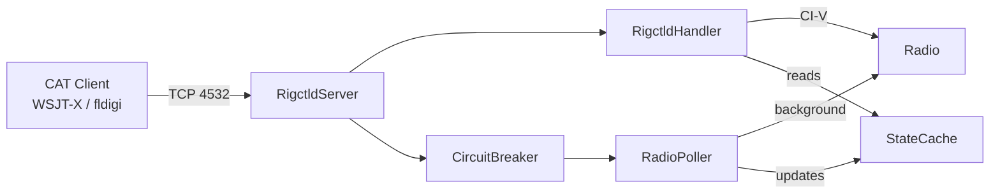
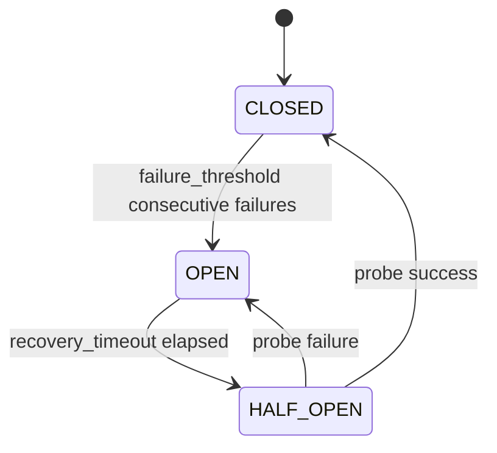

# Rigctld Server

Hamlib NET rigctld-compatible TCP server for rigplane.

Provides a drop-in replacement for `rigctld` that bridges the hamlib line-based TCP
protocol to a **Radio** instance (from `create_radio`). Clients such as WSJT-X, JS8Call, fldigi, and
rigctl connect over TCP (default port 4532) and issue standard hamlib CAT commands.

## Architecture



`RigctldServer` owns the TCP listener and per-client tasks. `RigctldHandler`
dispatches parsed commands to the **Radio** instance. `RadioPoller` runs in the background
and keeps `StateCache` warm so reads can be served without waiting for a CI-V
round-trip. `CircuitBreaker` prevents cascading failures when the radio stops
responding.

For timeout values, cache TTL semantics, and connection/readiness state, see
[Reliability semantics](../internals/reliability-semantics.md).

---

## Quick Start

### Standalone rigctld server (`rigplane serve`)

```bash
rigplane --host 192.168.1.10 --user admin --password secret serve
```

Options:

| Flag | Default | Description |
|------|---------|-------------|
| `--host HOST` | `0.0.0.0` | Listen address |
| `--port PORT` | `4532` | TCP port |
| `--read-only` | off | Reject all set commands |
| `--max-clients N` | `10` | Maximum concurrent clients |
| `--cache-ttl S` | `0.2` | Frequency/mode cache TTL (seconds) |
| `--wsjtx-compat` | off | Auto-enable DATA mode on first client connect |
| `--log-level LEVEL` | `INFO` | Logging verbosity |
| `--audit-log PATH` | disabled | Path for JSONL audit log |
| `--rate-limit N` | unlimited | Max commands/second per client |

### Embedded in the web server (`rigplane web`)

The `web` command starts the rigctld server on port 4532 by default alongside the
HTTP UI. Disable it with `--no-rigctld`, or change the port with `--rigctld-port`.

```bash
rigplane --host 192.168.1.10 web --rigctld-port 4533
rigplane --host 192.168.1.10 web --no-rigctld
```

### Embedded in Python

```python
import asyncio
from rigplane import create_radio, LanBackendConfig
from rigplane.rigctld import RigctldServer
from rigplane.rigctld.contract import RigctldConfig

async def main() -> None:
    radio_config = LanBackendConfig(host="192.168.1.10", username="admin", password="secret")
    async with create_radio(radio_config) as radio:
        config = RigctldConfig(host="0.0.0.0", port=4532)
        async with RigctldServer(radio, config) as server:
            await server.serve_forever()

asyncio.run(main())
```

---

## `RigctldServer`

```python
from rigplane.rigctld import RigctldServer
```

Asyncio TCP server implementing the hamlib NET rigctld protocol.

### Constructor

```python
RigctldServer(
    radio: Radio,
    config: RigctldConfig | None = None,
)
```

| Parameter | Type | Default | Description |
|-----------|------|---------|-------------|
| `radio` | `Radio` | *required* | Connected radio instance (from `create_radio`) |
| `config` | `RigctldConfig \| None` | `None` | Server config; uses `RigctldConfig()` defaults if omitted |

### Context Manager

```python
async with RigctldServer(radio, config) as server:
    await server.serve_forever()
```

Equivalent to calling `start()` on entry and `stop()` on exit.

### Methods

#### `start()`

```python
async def start(self) -> None
```

Start the TCP listener, initialise the command handler, and wire up the
`RadioPoller` and `CircuitBreaker`. The poller is started lazily on first
client connection.

#### `stop()`

```python
async def stop(self) -> None
```

Cancel all active client tasks, stop the poller, and close the TCP listener.
Idempotent.

#### `serve_forever()`

```python
async def serve_forever(self) -> None
```

Call `start()` then block until cancelled or `stop()` is called.

### Properties

#### `circuit_breaker_state`

```python
@property
def circuit_breaker_state(self) -> CircuitState | None
```

Current state of the internal circuit breaker, or `None` if not yet initialised
(before `start()` is called).

---

## `RigctldConfig`

```python
from rigplane.rigctld.contract import RigctldConfig
```

Dataclass holding all server configuration.

```python
RigctldConfig(
    host: str = "0.0.0.0",
    port: int = 4532,
    read_only: bool = False,
    max_clients: int = 10,
    client_timeout: float = 300.0,
    command_timeout: float = 2.0,
    cache_ttl: float = 0.2,
    max_line_length: int = 1024,
    poll_interval: float = 0.2,
    wsjtx_compat: bool = False,
    command_rate_limit: float | None = None,
)
```

| Field | Type | Default | Description |
|-------|------|---------|-------------|
| `host` | `str` | `"0.0.0.0"` | TCP listen address |
| `port` | `int` | `4532` | TCP port |
| `read_only` | `bool` | `False` | Reject all set commands with `RPRT -22` |
| `max_clients` | `int` | `10` | Maximum concurrent TCP connections |
| `client_timeout` | `float` | `300.0` | Seconds of inactivity before idle disconnect |
| `command_timeout` | `float` | `2.0` | Per-command CI-V timeout in seconds |
| `cache_ttl` | `float` | `0.2` | Maximum age (seconds) for cached frequency/mode values |
| `max_line_length` | `int` | `1024` | Maximum bytes per command line (OOM guard) |
| `poll_interval` | `float` | `0.2` | Background poll interval in seconds |
| `wsjtx_compat` | `bool` | `False` | Auto-enable DATA mode on first client connect |
| `command_rate_limit` | `float \| None` | `None` | Max commands/second per client; `None` = unlimited |

---

## `RigctldHandler`

```python
from rigplane.rigctld.handler import RigctldHandler
```

Dispatches parsed rigctld commands to the **Radio** instance. Handles the read-only gate,
frequency/mode cache, and translates rigplane exceptions to Hamlib error codes.

### Constructor

```python
RigctldHandler(
    radio: Radio,
    config: RigctldConfig,
    cache: StateCache | None = None,
)
```

| Parameter | Type | Description |
|-----------|------|-------------|
| `radio` | `Radio` | Connected radio instance (from `create_radio`) |
| `config` | `RigctldConfig` | Server configuration |
| `cache` | `StateCache \| None` | Shared state cache; creates a private one if omitted |

### Methods

#### `execute()`

```python
async def execute(self, cmd: RigctldCommand) -> RigctldResponse
```

Execute a parsed rigctld command and return the response.

Applies the read-only gate for set commands, looks up the handler in the
dispatch table, and translates exceptions:

| Exception | Hamlib code |
|-----------|-------------|
| `ConnectionError` | `EIO` (-6) |
| `TimeoutError` | `ETIMEOUT` (-5) |
| `ValueError` | `EINVAL` (-1) |
| Any other | `EINTERNAL` (-7) |

### Supported Commands

| Short | Long | Direction | Description |
|-------|------|-----------|-------------|
| `f` | `get_freq` | GET | Frequency in Hz |
| `F` | `set_freq` | SET | Frequency in Hz |
| `m` | `get_mode` | GET | Mode string + passband Hz |
| `M` | `set_mode` | SET | Mode string + optional passband |
| `t` | `get_ptt` | GET | PTT state (0/1) |
| `T` | `set_ptt` | SET | PTT on/off |
| `v` | `get_vfo` | GET | Current VFO name (`VFOA`) |
| `V` | `set_vfo` | SET | Accepted/ACKed; current backend keeps single-VFO operation |
| `j` | `get_rit` | GET | RIT offset from live radio state |
| `l` | `get_level` | GET | Level read (`STRENGTH`, `RFPOWER`, `SWR`, `AF`, `RF`, etc.) |
| `L` | `set_level` | SET | Level write (`RFPOWER`, `AF`, `RF`, `NR`, `NB`, etc.) |
| `u` | `get_func` | GET | Function read (`NB`, `NR`, `COMP`, `VOX`, etc.) |
| `U` | `set_func` | SET | Function write (`NB`, `NR`, `COMP`, `VOX`, etc.) |
| `s` | `get_split_vfo` | GET | Split VFO status |
| `S` | `set_split_vfo` | SET | Accepted/ACKed (compat path) |
| `q` | `quit` | CTL | Close connection |
| `\dump_state` | `dump_state` | CTL | IC-7610 capability block |
| `1` | `dump_caps` | CTL | Alias for `dump_state` |
| `\get_info` | `get_info` | CTL | Rig info string |
| `\chk_vfo` | `chk_vfo` | CTL | VFO mode check (always 0) |
| `\get_powerstat` | `get_powerstat` | CTL | Power status (always 1) |
| `\power2mW` | `power2mW` | CTL | Normalised power → milliwatts |
| `\mW2power` | `mW2power` | CTL | Milliwatts → normalised power |
| `\get_lock_mode` | `get_lock_mode` | CTL | Lock mode (always 0) |
| `w` | `send_raw` | CTL | Raw CI-V passthrough (hex in, hex out) |

**Mode strings** accepted/returned by `get_mode`/`set_mode`:
`USB`, `LSB`, `CW`, `CWR`, `RTTY`, `RTTYR`, `AM`, `FM`, `WFM`,
`PKTUSB`, `PKTLSB`, `PKTRTTY` (DATA overlay modes mapped to/from CI-V DATA mode).

**Level names** for `get_level`:

| Name | Returns | Range |
|------|---------|-------|
| `STRENGTH` | S-meter in dBm (−54 to +60) | −54 … +60 |
| `RFPOWER` | Normalised RF power | 0.0 … 1.0 |
| `SWR` | SWR ratio | 1.0 … 5.0 |
| `AF`, `RF`, `NR`, `NB`, `COMP`, `MICGAIN`, `MONITOR_GAIN` | Normalised float | 0.0 … 1.0 |
| `RFPOWER_METER`, `COMP_METER`, `ID_METER`, `VD_METER` | Normalised float | 0.0 … 1.0 |
| `KEYSPD` | Key speed (WPM) | radio-dependent int |
| `CWPITCH` | CW pitch (Hz) | radio-dependent int |
| `PREAMP` | Preamp level in dB | 0 / 12 / 20 |
| `ATT` | Attenuator in dB | 0 / 6 / 12 / 18 |

**Writable levels** for `set_level`:

`RFPOWER`, `AF`, `RF`, `NR`, `NB`, `COMP`, `MICGAIN`, `MONITOR_GAIN`,
`KEYSPD`, `CWPITCH`, `PREAMP`, `ATT`.

**Function names** for `get_func` / `set_func`:

`NB`, `NR`, `COMP`, `VOX`, `TONE`, `TSQL`, `ANF`, `LOCK`, `MON`, `APF`.

### `w` / `send_raw` passthrough

Send raw CI-V bytes and return raw response bytes (space-separated uppercase hex).

Accepted input formats:

1. Space-separated tokens:

   ```text
   w FE FE 98 E0 03 FD
   ```

2. Single escaped argument:

   ```text
   w \xFE\xFE\x98\xE0\x03\xFD
   ```

Behavior details:

- If backend exposes `_send_civ_raw`, command forwards bytes as-is.
- On transport timeout (`rigplane.exceptions.TimeoutError` or `asyncio.TimeoutError`),
  handler returns **successful empty response** (not `RPRT -5`).
- If backend does not implement `_send_civ_raw`, returns `ENIMPL` (`RPRT -4`).

---

## `RadioPoller`

```python
from rigplane.rigctld.poller import RadioPoller
```

Background asyncio task that periodically polls the radio (frequency, mode, DATA
mode) and updates a shared `StateCache`. Started and stopped automatically by
`RigctldServer` based on whether any clients are connected.

### Constructor

```python
RadioPoller(
    radio: Radio,
    cache: StateCache,
    config: RigctldConfig,
    circuit_breaker: CircuitBreaker | None = None,
)
```

### Methods

#### `start()`

```python
async def start(self) -> None
```

Start the background poll loop. Idempotent.

#### `stop()`

```python
async def stop(self) -> None
```

Cancel the background poll loop and wait for it to finish. Idempotent.

#### `hold_for()`

```python
def hold_for(self, seconds: float) -> None
```

Suppress polling for `seconds` seconds. Used internally to avoid CI-V
interleaving during DATA mode transitions (USB → PKT modes).

### Attributes

| Attribute | Type | Description |
|-----------|------|-------------|
| `write_busy` | `bool` | Set to `True` while a set command is in flight; poller skips cycles |

---

## `CircuitBreaker`

```python
from rigplane.rigctld.circuit_breaker import CircuitBreaker, CircuitState
```

State-machine circuit breaker wrapping CI-V command execution. Prevents
cascading failures when the radio stops responding.

### States



### `CircuitState` enum

| Value | Description |
|-------|-------------|
| `CLOSED` | Normal operation; commands pass through |
| `OPEN` | Fast-fail; commands rejected immediately |
| `HALF_OPEN` | One probe allowed to test connectivity |

### Constructor

```python
CircuitBreaker(
    failure_threshold: int = 3,
    recovery_timeout: float = 5.0,
)
```

| Parameter | Type | Default | Description |
|-----------|------|---------|-------------|
| `failure_threshold` | `int` | `3` | Consecutive failures before opening |
| `recovery_timeout` | `float` | `5.0` | Seconds in OPEN before transitioning to HALF_OPEN |

**Raises:** `ValueError` if `failure_threshold < 1` or `recovery_timeout <= 0`.

### Methods

#### `allow_request()`

```python
def allow_request(self) -> bool
```

Return `True` if a command may proceed. Returns `False` only when OPEN.

#### `record_success()`

```python
def record_success(self) -> None
```

Record a successful command. Resets failure counter and closes the circuit.

#### `record_failure()`

```python
def record_failure(self) -> None
```

Record a failed command. Increments the counter (CLOSED) or re-opens (HALF_OPEN).

### Properties

| Property | Type | Description |
|----------|------|-------------|
| `state` | `CircuitState` | Current state (may trigger OPEN→HALF_OPEN on read) |
| `consecutive_failures` | `int` | Failures since last success |
| `failure_threshold` | `int` | Threshold to open the circuit |
| `recovery_timeout` | `float` | Seconds before OPEN→HALF_OPEN |

---

## `StateCache`

```python
from rigplane.rigctld.state_cache import StateCache
```

Last-known radio state with per-field monotonic timestamps. Shared between
`RigctldHandler` (reads) and `RadioPoller` (writes). Not thread-safe; all
access must occur on the same asyncio event loop.

### Cached Fields

| Field | Type | Description |
|-------|------|-------------|
| `freq` | `int` | VFO-A frequency in Hz |
| `mode` | `str` | Hamlib mode string (e.g. `"USB"`) |
| `filter_width` | `int \| None` | IC-7610 filter number (1–3) or `None` |
| `data_mode` | `bool` | DATA mode state (True = DATA1 active) |
| `vfo` | `str` | Current VFO name (always `"VFOA"`) |
| `ptt` | `bool` | PTT state |
| `s_meter` | `int \| None` | Raw S-meter value (0–241) |
| `rf_power` | `float \| None` | Normalised RF power (0.0–1.0) |
| `swr` | `float \| None` | SWR meter value |
| `alc` | `float \| None` | ALC meter value |
| `rf_gain` | `float \| None` | RF gain (0–255) |
| `af_level` | `float \| None` | AF level (0–255) |
| `attenuator` | `int \| None` | Attenuator level in dB |
| `preamp` | `int \| None` | Preamp level (0=off, 1=PREAMP1, 2=PREAMP2) |

Each field has a corresponding `<field>_ts` float timestamp (`time.monotonic()`);
`0.0` means the field has never been written.

### Key Methods

#### `is_fresh()`

```python
def is_fresh(self, field: CacheField, max_age_s: float) -> bool
```

Return `True` if `field` was updated within `max_age_s` seconds.

#### `snapshot()`

```python
def snapshot(self) -> dict[str, object]
```

Return all cached values and their ages (`<field>_age` in seconds, or `None` if
never written).

#### Update helpers

| Method | Description |
|--------|-------------|
| `update_freq(freq)` | Store new frequency |
| `invalidate_freq()` | Force next read to hit the radio |
| `update_mode(mode, filter_width)` | Store mode and filter |
| `invalidate_mode()` | Force next read to hit the radio |
| `update_ptt(ptt)` | Store PTT state |
| `update_s_meter(value)` | Store raw S-meter value |
| `update_rf_power(value)` | Store normalised RF power |
| `update_data_mode(on)` | Store DATA mode state |
| `invalidate_data_mode()` | Force next read to hit the radio |
| `update_swr(value)` | Store SWR value |
| `update_alc(value)` | Store ALC value |
| `update_rf_gain(value)` | Store RF gain |
| `update_af_level(value)` | Store AF level |
| `update_attenuator(value)` | Store attenuator dB |
| `update_preamp(value)` | Store preamp level |

---

## Protocol Internals

### `parse_line()`

```python
from rigplane.rigctld.protocol import parse_line

def parse_line(line: bytes) -> RigctldCommand
```

Parse a raw rigctld command line into a `RigctldCommand`. Raises `ValueError` on
unknown commands or wrong argument counts.

### `format_response()`

```python
def format_response(
    cmd: RigctldCommand,
    resp: RigctldResponse,
    session: ClientSession,
) -> bytes
```

Format a response for wire transmission. Respects `session.extended_mode` —
normal mode returns bare values or `RPRT <code>`, extended mode echoes the
command name and always appends `RPRT <code>`.

### `format_error()`

```python
def format_error(code: int) -> bytes
```

Format a bare Hamlib error response, e.g. `b'RPRT -1\n'`.

---

## Shared Dataclasses

### `RigctldCommand`

```python
from rigplane.rigctld.contract import RigctldCommand
```

Frozen dataclass representing a parsed client command.

| Attribute | Type | Description |
|-----------|------|-------------|
| `short_cmd` | `str` | Single-char command (e.g. `'f'`, `'F'`) |
| `long_cmd` | `str` | Long-form name (e.g. `'get_freq'`) |
| `args` | `tuple[str, ...]` | String arguments |
| `is_set` | `bool` | `True` for write/set commands |

### `RigctldResponse`

```python
from rigplane.rigctld.contract import RigctldResponse
```

Mutable dataclass representing the response to send back to the client.

| Attribute | Type | Description |
|-----------|------|-------------|
| `values` | `list[str]` | Response lines for get commands |
| `error` | `int` | Hamlib error code (0 = success) |
| `cmd_echo` | `str` | Command echo string for extended protocol |
| `ok` | `bool` | `True` when `error == 0` (property) |

---

## Audit Logging

### `AuditRecord`

```python
from rigplane.rigctld.audit import AuditRecord
```

Immutable dataclass capturing a single command execution.

| Attribute | Type | Description |
|-----------|------|-------------|
| `timestamp` | `str` | ISO 8601 UTC timestamp |
| `client_id` | `int` | Server-assigned client identifier |
| `peername` | `str` | `"host:port"` of the TCP client |
| `cmd` | `str` | Short command string |
| `long_cmd` | `str` | Long command name |
| `args` | `tuple[str, ...]` | Command arguments |
| `duration_ms` | `float` | Wall-clock execution time in ms |
| `rprt` | `int` | Hamlib `RPRT` code |
| `is_set` | `bool` | `True` for write commands |

### `RigctldAuditFormatter`

```python
from rigplane.rigctld.audit import RigctldAuditFormatter, AUDIT_LOGGER_NAME
```

`logging.Formatter` subclass that serialises `AuditRecord` entries as a single
JSON line. Attach it to a handler on the `rigplane.rigctld.audit` logger:

```python
import logging
from rigplane.rigctld.audit import AUDIT_LOGGER_NAME, RigctldAuditFormatter

fh = logging.FileHandler("audit.jsonl")
fh.setFormatter(RigctldAuditFormatter())
logging.getLogger(AUDIT_LOGGER_NAME).addHandler(fh)
```

Example output line:

```json
{"timestamp": "2026-03-03T12:00:00.000Z", "client_id": 1, "peername": "127.0.0.1:54321", "cmd": "F", "long_cmd": "set_freq", "args": ["14074000"], "duration_ms": 18.4, "rprt": 0, "is_set": true}
```

---

## `HamlibError`

```python
from rigplane.rigctld.contract import HamlibError
```

`IntEnum` of standard Hamlib error codes.

| Name | Value | Meaning |
|------|-------|---------|
| `OK` | 0 | Success |
| `EINVAL` | -1 | Invalid parameter |
| `ECONF` | -2 | Invalid configuration |
| `ENOMEM` | -3 | Memory shortage |
| `ENIMPL` | -4 | Function not implemented |
| `ETIMEOUT` | -5 | Communication timed out |
| `EIO` | -6 | I/O error |
| `EINTERNAL` | -7 | Internal Hamlib error |
| `EPROTO` | -8 | Protocol error |
| `ERJCTED` | -9 | Command rejected by the rig |
| `ETRUNC` | -10 | Argument truncated |
| `ENAVAIL` | -11 | Function not available |
| `ENTARGET` | -12 | VFO not targetable |
| `BUSERR` | -13 | Bus error (CI-V collision) |
| `BUSBUSY` | -14 | Bus busy (CW keying) |
| `EARG` | -15 | Invalid argument |
| `EVFO` | -16 | Invalid VFO |
| `EDOM` | -17 | Domain error |
| `EDEPRECATED` | -18 | Deprecated function |
| `ESECURITY` | -19 | Security error |
| `EPOWER` | -20 | Rig not powered on |
| `EEND` | -21 | Not end of list |
| `EACCESS` | -22 | Permission denied (read-only mode) |

---

## `run_rigctld_server()`

```python
from rigplane.rigctld.server import run_rigctld_server

async def run_rigctld_server(radio: Radio, **kwargs) -> None
```

Convenience coroutine: create a `RigctldServer` from keyword arguments (forwarded
to `RigctldConfig`) and run it forever.

```python
await run_rigctld_server(radio, host="0.0.0.0", port=4532, read_only=True)
```
