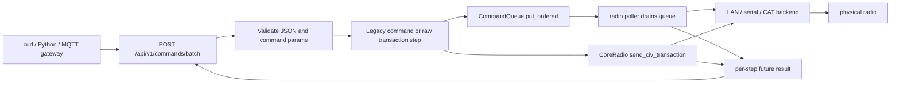

# Web Server API

Built-in HTTP + WebSocket interface used by the browser UI and automation clients.

## Stability Contract

The managed-supervisor contract is versioned separately from the browser UI.
The current contract version is `1`.

Stable routes are source-compatible within the same major `/api/v1` namespace:

- existing required response fields remain present;
- new optional fields may be added without a version bump;
- new enum/string values may be added when clients can ignore unknown values;
- removing fields, changing field type, or changing route semantics requires a
  new versioned route or an explicit migration note.

Stable contract metadata is maintained in `rigplane.web.api_contract` and
covered by tests. Pro and other supervisors should depend on the stable routes
below, not on browser static assets, private handler classes, or routes marked
diagnostic/experimental.

## Auth Model

If web server is started with `--auth-token`, `--auth-token-file`, or
`RIGPLANE_AUTH_TOKEN` in managed mode, all `/api/*` HTTP routes require:

```
Authorization: Bearer <token>
```

WebSocket routes additionally allow query token:

```
ws://host:8080/api/v1/ws?token=<token>
```

## HTTP Endpoints

### Stable Supervisor Endpoints

These routes are part of the Pro/supervisor compatibility surface:

| Method | Path | Purpose |
|-------|------|---------|
| `GET` | `/healthz` | Process/API liveness, no API token required |
| `GET` | `/readyz` | Station readiness, returns `503` until radio is ready |
| `GET` | `/api/v1/runtime` | Process, bind, radio, rigctld, bridge, and diagnostic runtime status |
| `GET` | `/api/v1/station` | Friendly station-server identity, readiness, and next-action status |
| `GET` | `/api/v1/info` | Runtime model/capability summary |
| `GET` | `/api/v1/state` | Canonical current state snapshot |
| `GET` | `/api/v1/capabilities` | Full profile-backed capabilities |
| `GET` | `/api/v1/audio/analysis` | Audio analysis snapshot when analyzer is active |
| `GET` | `/api/v1/bridge` | Audio bridge status |
| `POST` | `/api/v1/bridge` | Start audio bridge |
| `DELETE` | `/api/v1/bridge` | Stop audio bridge |
| `POST` | `/api/v1/commands` | Enqueue one structured radio command |
| `POST` | `/api/v1/commands/batch` | Apply a stateless ordered command batch |
| `POST` | `/api/v1/civ/transaction` | Send one scoped raw CI-V transaction with explicit response handling |

### Other Web UI Endpoints

| Method | Path | Purpose |
|-------|------|---------|
| `GET` | `/api/v1/dx/spots` | Buffered DX spots |
| `GET` | `/api/v1/band-plan/config` | Active band-plan region |
| `GET` | `/api/v1/band-plan/layers` | Band-plan layers metadata |
| `GET` | `/api/v1/band-plan/segments?start=<hz>&end=<hz>&layers=<csv>` | Band-plan overlay segments |
| `GET` | `/api/v1/eibi/status` | EiBi loader status |
| `GET` | `/api/v1/eibi/stations` | EiBi station list (paged/filterable) |
| `GET` | `/api/v1/eibi/segments?start=<hz>&end=<hz>&on_air=true` | EiBi overlay segments |
| `GET` | `/api/v1/eibi/identify?freq=<hz>&tolerance=<hz>` | Identify probable broadcast stations |
| `GET` | `/api/v1/eibi/bands` | EiBi frequency bands |

### Control Endpoints

| Method | Path | Purpose |
|-------|------|---------|
| `POST` | `/api/v1/radio/connect` | Connect/reconnect radio control path |
| `POST` | `/api/v1/radio/disconnect` | Disconnect radio control path |
| `POST` | `/api/v1/radio/power` | Power on/off via CI-V power control |
| `POST` | `/api/v1/commands` | Enqueue one structured radio command |
| `POST` | `/api/v1/commands/batch` | Apply a stateless ordered command batch |
| `POST` | `/api/v1/civ/transaction` | Send one scoped raw CI-V transaction |
| `POST` | `/api/v1/band-plan/config` | Change active region and reload band plans |
| `POST` | `/api/v1/eibi/fetch` | Fetch/refresh EiBi dataset |

### WebSocket Routes

Stable supervisor routes:

| Path | Purpose | Availability |
|------|---------|--------------|
| `/api/v1/ws` | Control events and commands | always |
| `/api/v1/scope` | Hardware or audio FFT spectrum stream | when scope or audio FFT is available |
| `/api/v1/audio` | Audio control and media frames | when radio/audio backend supports audio |
| `/api/v1/audio-scope` | Audio FFT spectrum stream | when audio FFT is available |

WebSocket auth accepts the same bearer header as HTTP. Query token auth is also
accepted for browser/WebSocket clients that cannot set headers.

### Structured Command Surface

`/api/v1/ws`, `POST /api/v1/commands`, and
`POST /api/v1/commands/batch` use the same structured command names and
`params` objects. For example, `set_freq` and `set_mode` mean the same thing
over WebSocket, single-command HTTP, and batch HTTP.

The current public docs include common command examples in
[Web UI: Common commands](../guide/web-ui.md#common-commands), and lower-level
Python/CI-V command examples in [CI-V Commands](../guide/commands.md). The full
machine-readable HTTP/WS command catalog — every command name, parameter shape,
capability gate, and batch-eligibility flag — is published in
[HTTP / WebSocket Command Catalog](command-catalog.md).

### Internal And Diagnostic Surface

Browser static files, `src/rigplane/web/static*`, handler class names, queue
shapes, diagnostic upload routes, EiBi/Band Plan helpers, and DX cluster helper
routes are not the Pro supervisor contract unless they are promoted into
`rigplane.web.api_contract`.

---

## `GET /healthz`

Process liveness probe for local supervisors. This endpoint is intentionally
outside `/api/*`, so it does not require bearer auth.

```json
{
  "status": "ok",
  "pid": 12345,
  "version": "2.0.3"
}
```

## `GET /readyz`

Station readiness probe. Returns HTTP `200` when the attached radio is ready
and HTTP `503` while the process is alive but the station is not ready.

```json
{
  "status": "ready",
  "radioReady": true
}
```

## `GET /api/v1/runtime`

Machine-readable runtime status for managed local supervisors and diagnostics.
When auth is configured, this endpoint requires the same bearer token as other
`/api/*` routes.

```json
{
  "pid": 12345,
  "uptimeSeconds": 12.3,
  "version": "2.0.3",
  "bind": { "host": "127.0.0.1", "port": 8080 },
  "logPath": "/Users/me/Library/Logs/rigplane.log",
  "authRequired": true,
  "backend": "rigplane",
  "radio": {
    "model": "IC-7610",
    "connected": true,
    "controlConnected": true,
    "radioReady": true
  },
  "station": {
    "readiness": "ready_with_radio",
    "radioAvailable": true,
    "backend": "rigplane",
    "authRequired": true,
    "message": "Station server is ready with an attached radio."
  },
  "rigctld": {
    "enabled": true,
    "address": "127.0.0.1:4532"
  },
  "bridge": {
    "enabled": false,
    "running": false
  },
  "lastError": null
}
```

## `POST /api/v1/commands`

HTTP command envelope for automation clients that do not need WebSocket
delivery. The command names and `params` match the `/api/v1/ws` command channel.
The endpoint accepts the command into RigPlane's normal command queue and
returns the same acknowledgement shape as the WebSocket command handler.

Request:

```json
{
  "id": "button-1",
  "name": "set_freq",
  "params": { "freq": 144030000, "receiver": 0 }
}
```

Response:

```json
{
  "id": "button-1",
  "ok": true,
  "name": "set_freq",
  "result": { "freq": 144030000, "receiver": 0 }
}
```

`id` is optional and echoed when present. Unknown command names and malformed
parameters return HTTP `400`. Read-only mode rejects transmit commands with
HTTP `403`.

Low-level CI-V escape hatch:

```json
{
  "id": "display-type-b",
  "name": "send_civ",
  "params": {
    "command": 26,
    "sub": 5,
    "data": "015301"
  }
}
```

`send_civ` is for Icom/vendor-specific commands that are not yet exposed as
structured RigPlane commands. `command` and `sub` are byte values from `0` to
`255`; `sub` may be omitted. `data` is an even-length hexadecimal string. The
HTTP command is fire-and-forget: RigPlane enqueues the CI-V write through the
same single-owner command queue, but does not return CI-V response bytes or
claim readback verification. `wait_response` is rejected when `true`; use
`POST /api/v1/civ/transaction` when the caller needs an ACK, NAK, or data
response.

## `POST /api/v1/civ/transaction`

Scoped raw CI-V transaction endpoint for local automation that needs a
deterministic radio response. This endpoint bypasses the normal
`RadioPoller` command queue, claims the CI-V stream while the transaction is
active, and releases that claim on success, NAK, timeout, error, or
cancellation. It uses the existing runtime CI-V receive pump and request
tracker; it does not create a second raw listener path.

Request:

```json
{
  "id": "display-type-b",
  "command": 26,
  "sub": 5,
  "data": "015301",
  "expect": "ack",
  "timeout_ms": 1000
}
```

`command` and `sub` are byte values from `0` to `255`; `sub` may be omitted.
`data` is an even-length compact hexadecimal string. `expect` is required by
behavior, defaults to `"data"` for compatibility, and must be one of:

| Value | Behavior |
|-------|----------|
| `"none"` | Send the raw CI-V frame and return `status: "sent"` without waiting |
| `"ack"` | Wait for the next CI-V ACK or NAK and return `status: "ack"` or `"nak"` |
| `"data"` | Wait for the matching data response for the request command/sub |

`timeout_ms` is optional and must be positive when present. All waits are
bounded by the timeout.

Python example:

```python
import json
import urllib.request

base_url = "http://127.0.0.1:8080"
token = None  # or "your-token"

payload = {
    "id": "display-type-b",
    "command": 26,
    "sub": 5,
    "data": "015301",
    "expect": "ack",
    "timeout_ms": 1000,
}

request = urllib.request.Request(
    f"{base_url}/api/v1/civ/transaction",
    data=json.dumps(payload).encode("utf-8"),
    headers={"Content-Type": "application/json"},
    method="POST",
)
if token:
    request.add_header("Authorization", f"Bearer {token}")

with urllib.request.urlopen(request, timeout=5) as response:
    result = json.load(response)

if not result["ok"]:
    raise SystemExit(result)
```

ACK response:

```json
{
  "id": "display-type-b",
  "ok": true,
  "status": "ack",
  "result": {
    "frame": "FEFEE0A2FBFD",
    "command": 251,
    "sub": null,
    "data": ""
  }
}
```

NAK response uses HTTP `200` with deterministic failure JSON:

```json
{
  "ok": false,
  "status": "nak",
  "error": "radio_nak",
  "result": {
    "frame": "FEFEE0A2FAFD",
    "command": 250,
    "sub": null,
    "data": ""
  }
}
```

Errors:

| HTTP | Error | Meaning |
|------|-------|---------|
| `400` | `invalid_request` | Malformed command/sub/data/expect/timeout |
| `403` | `read_only` | Server is running in read-only mode |
| `409` | `unsupported_command` | Active backend does not expose raw CI-V transactions |
| `409` | `civ_owner_conflict` | Another external CAT/transaction owner already owns the CI-V stream |
| `503` | `no_radio` | No radio backend is configured |
| `504` | `transaction_timeout` | Expected ACK/data response did not arrive before timeout |

Use this endpoint only for model-specific commands where callers need the
wire-level result. Keep normal profile/control automation on
`/api/v1/commands` or `/api/v1/commands/batch`.

## `POST /api/v1/commands/batch`

Stateless ordered batch apply for local automation. RigPlane does not store,
name, schedule, or share batches in Core. Clients send the full sequence on
each request.

Use this endpoint when an external controller needs an all-or-reported-nothing
profile switch: tune frequency, select mode/filter, adjust levels, switch
audio/data state, recall memory, query model-specific CI-V state, or apply
other supported operations as one ordered operation.

Batch steps are validated and executed in request order. Legacy command steps
are placed on an exact-order command-queue lane, and the HTTP handler waits for
the poller/backend to finish that step before advancing to the next step.
Raw CI-V transaction steps execute through `send_civ_transaction()` outside
`RadioPoller`; the handler still waits for each transaction result before
considering the next request step. Repeated commands are not deduplicated
inside the ordered lane.

Maximum batch size is 128 steps. Legacy command steps use a 10 second
execution timeout. Raw CI-V transaction steps use `timeout_ms` when present,
otherwise the same 10 second default. If the radio link is slow or
disconnected, the failing step is reported and later steps are skipped unless
`continue_on_error` is `true`.

Batch steps can use either shape:

- legacy command steps: `{ "name": "set_freq", "params": { ... } }`;
- response-capable raw CI-V transaction steps:
  `{ "type": "raw_civ_transaction", ... }`.

`send_civ` remains the fire-and-forget raw CI-V command. It is queued like
other legacy command steps, returns the command parameters that were accepted,
does not wait for ACK/data/NAK frames, and still rejects `wait_response=true`.
Use a `raw_civ_transaction` step when the caller needs the radio's wire-level
ACK, NAK, or data response inside the ordered batch.

Data flow:



Request:

```json
{
  "id": "vara-fm",
  "continue_on_error": false,
  "steps": [
    { "name": "set_freq", "params": { "freq": 144030000 } },
    {
      "name": "send_civ",
      "params": { "command": 26, "sub": 5, "data": "015301" }
    },
    {
      "type": "raw_civ_transaction",
      "id": "display-type-query",
      "command": 26,
      "sub": 5,
      "data": "0153",
      "expect": "data",
      "timeout_ms": 250
    },
    {
      "type": "raw_civ_transaction",
      "id": "display-type-apply",
      "command": 26,
      "sub": 5,
      "data": "015301",
      "expect": "ack"
    },
    {
      "name": "set_mode",
      "params": { "mode": "FM" }
    }
  ]
}
```

Raw CI-V transaction step fields:

| Field | Required | Meaning |
|-------|----------|---------|
| `type` | yes | Must be `"raw_civ_transaction"` |
| `command` | yes | CI-V command byte, `0` through `255` |
| `expect` | yes | `"none"`, `"ack"`, or `"data"` |
| `id` | no | Caller-owned value echoed in this step's result |
| `sub` | no | CI-V subcommand byte, `0` through `255` |
| `data` | no | Compact even-length hexadecimal string; response hex is uppercase |
| `timeout_ms` | no | Positive finite timeout in milliseconds for this transaction step |

Successful response:

```json
{
  "id": "vara-fm",
  "ok": true,
  "results": [
    {
      "index": 0,
      "name": "set_freq",
      "ok": true,
      "status": "executed",
      "result": { "freq": 144030000, "receiver": 0 }
    },
    {
      "index": 1,
      "name": "send_civ",
      "ok": true,
      "status": "executed",
      "result": {
        "command": 26,
        "sub": 5,
        "data": "015301",
        "wait_response": false
      }
    },
    {
      "index": 2,
      "type": "raw_civ_transaction",
      "id": "display-type-query",
      "ok": true,
      "status": "response",
      "result": {
        "frame": "FEFEE0981A050153FD",
        "command": 26,
        "sub": 5,
        "data": "0153"
      }
    },
    {
      "index": 3,
      "type": "raw_civ_transaction",
      "id": "display-type-apply",
      "ok": true,
      "status": "ack",
      "result": {
        "frame": "FEFEE0A2FBFD",
        "command": 251,
        "sub": null,
        "data": ""
      }
    },
    {
      "index": 4,
      "name": "set_mode",
      "ok": true,
      "status": "executed",
      "result": { "mode": "FM", "receiver": 0 }
    }
  ]
}
```

`expect: "none"` sends one CI-V frame and returns `status: "sent"` without
waiting for a radio frame. `expect: "ack"` waits for ACK or NAK.
`expect: "data"` waits for the matching data response, while a fresh NAK still
returns `status: "nak"` and `error: "radio_nak"`.

NAK failure with skipped later steps:

```json
{
  "ok": false,
  "results": [
    {
      "index": 0,
      "type": "raw_civ_transaction",
      "ok": false,
      "status": "nak",
      "error": "radio_nak",
      "message": "radio returned CI-V NAK",
      "result": {
        "frame": "FEFEE0A2FAFD",
        "command": 250,
        "sub": null,
        "data": ""
      }
    },
    {
      "index": 1,
      "name": "set_mode",
      "ok": false,
      "status": "skipped",
      "error": "skipped_after_failure",
      "message": "skipped after earlier batch failure"
    }
  ]
}
```

Set `continue_on_error` to `true` to keep applying later valid steps after a
validation, timeout, or execution failure. When present, `continue_on_error`
must be a JSON boolean at the batch root. A transaction step-level
`continue_on_error` field is invalid. Raw CI-V transaction failures that obey
the continuation rule include `nak`, `timed_out`, `owner_conflict`,
`unsupported`, `read_only`, `no_radio`, `failed_validation`, and
`failed_execution`. Commands marked `Batch: No` in the command catalog, such
as `send_cw_text`, read-only getter commands, and direct helper operations, are
rejected in batches with `unsupported_in_batch`; use
`POST /api/v1/commands` for those one-off calls.

Timeout with `continue_on_error: true`:

```json
{
  "ok": false,
  "results": [
    {
      "index": 0,
      "type": "raw_civ_transaction",
      "ok": false,
      "status": "timed_out",
      "error": "transaction_timeout",
      "message": "raw CI-V transaction timed out"
    },
    {
      "index": 1,
      "name": "set_mode",
      "ok": true,
      "status": "executed",
      "result": { "mode": "FM", "receiver": 0 }
    }
  ]
}
```

Other raw CI-V transaction step failures use these per-step `status` and
`error` values:

| Case | `status` | `error` |
|------|----------|---------|
| Timeout | `timed_out` | `transaction_timeout` |
| Another CAT/transaction owner is active | `owner_conflict` | `civ_owner_conflict` |
| Backend lacks raw transaction support | `unsupported` | `unsupported_command` |
| Server is read-only | `read_only` | `read_only` |
| No active radio for a transaction-only batch | `no_radio` | `no_radio` |
| Malformed transaction step | `failed_validation` | `invalid_request` or `invalid_step` |
| Runtime failure from `send_civ_transaction()` | `failed_execution` | `transaction_failed` |
| Later step skipped after failure | `skipped` | `skipped_after_failure` |

Unsupported typed batch steps are handled separately from malformed
`raw_civ_transaction` steps. If a step has `type` present, the type is not
supported, and no legacy `name` is present, that step returns
`status: "failed_validation"` with `error: "unknown_step_type"`.

If a queued step is not consumed by the poller before the step timeout, the
result status is `timed_out` with error `command_timeout`. Unconsumed timed-out
steps are cancelled before execution. If a batch mixes legacy command steps
with raw transaction steps and no radio is configured, the endpoint keeps the
legacy behavior and returns HTTP `503 no_radio` before per-step execution.

### Profile-Switching Example

Core treats a radio profile as a caller-owned batch, not as stored server
state. Core does not store, name, schedule, or share profiles; callers own any
batch/profile catalog they build. This keeps the open-core API generic while
still supporting local Stream Deck, MQTT, shell, and Python automation.

Example IC-9700-style local batches:

```json
{
  "vara-fm": {
    "id": "vara-fm",
    "steps": [
      { "name": "set_freq", "params": { "freq": 144030000, "receiver": 0 } },
      { "name": "set_mode", "params": { "mode": "FM", "receiver": 0 } },
      { "name": "set_data_mode", "params": { "mode": 1, "receiver": 0 } },
      { "name": "set_data1_mod_input", "params": { "source": 3 } },
      { "name": "set_usb_mod_level", "params": { "level": 72 } },
      { "name": "set_af_level", "params": { "level": 72, "receiver": 0 } },
      { "name": "set_squelch", "params": { "level": 0, "receiver": 0 } }
    ]
  },
  "fm-voice": {
    "id": "fm-voice",
    "steps": [
      { "name": "set_mode", "params": { "mode": "FM", "receiver": 0 } },
      { "name": "set_data_mode", "params": { "mode": 0, "receiver": 0 } },
      { "name": "set_data_off_mod_input", "params": { "source": 0 } },
      { "name": "set_af_level", "params": { "level": 50, "receiver": 0 } }
    ]
  }
}
```

For `set_data_mode`, HTTP/WS params use the numeric DATA mode value from the
active radio profile, not an `enabled` boolean. The current IC-9700 profile
defines `0 = OFF`, `1 = DATA`. Its modulation input source values are
`0 = MIC`, `1 = ACC`, `2 = MIC+ACC`, `3 = USB`, and `4 = MIC+USB`.

Actual command availability depends on the active radio profile and backend.
Fetch `/api/v1/capabilities` before enabling buttons or publishing a reusable
profile.

### Automation Examples

Check capabilities before building model-specific batches. The capability
payload tells clients which receivers, modes, filters, audio controls, memory
operations, and feature toggles are available on the active radio:

```bash
curl http://127.0.0.1:8080/api/v1/capabilities
```

Prefer structured commands whenever a command exists. Use `send_civ` for
vendor-specific CI-V that is not yet abstracted, such as display/menu settings.
It still lets RigPlane own the radio connection, queueing, pacing, auth policy,
and safety checks; it just does not return response bytes.

Python example:

```python
import json
import urllib.request

base_url = "http://127.0.0.1:8080"
token = None  # or "your-token"

batch = {
    "id": "vara-fm",
    "steps": [
        {"name": "set_freq", "params": {"freq": 144030000}},
        {"name": "set_mode", "params": {"mode": "FM"}},
        {"name": "set_data_mode", "params": {"mode": 1}},
        {"name": "set_data1_mod_input", "params": {"source": 3}},
        {"name": "set_usb_mod_level", "params": {"level": 72}},
        {"name": "set_af_level", "params": {"level": 72}},
    ],
}

body = json.dumps(batch).encode("utf-8")
request = urllib.request.Request(
    f"{base_url}/api/v1/commands/batch",
    data=body,
    headers={"Content-Type": "application/json"},
    method="POST",
)
if token:
    request.add_header("Authorization", f"Bearer {token}")

with urllib.request.urlopen(request, timeout=30) as response:
    result = json.load(response)

if not result["ok"]:
    raise SystemExit(result)
```

Minimal MQTT gateway sketch:

```python
import json
import urllib.request

import paho.mqtt.client as mqtt

RIGPLANE_URL = "http://127.0.0.1:8080"

BATCHES = {
    "vara-fm": {
        "id": "vara-fm",
        "steps": [
            {"name": "set_freq", "params": {"freq": 144030000}},
            {"name": "set_mode", "params": {"mode": "FM"}},
            {"name": "set_data_mode", "params": {"mode": 1}},
            {"name": "set_data1_mod_input", "params": {"source": 3}},
            {"name": "set_usb_mod_level", "params": {"level": 72}},
        ],
    },
    "fm-voice": {
        "id": "fm-voice",
        "steps": [
            {"name": "set_mode", "params": {"mode": "FM"}},
            {"name": "set_data_mode", "params": {"mode": 0}},
            {"name": "set_data_off_mod_input", "params": {"source": 0}},
            {"name": "set_af_level", "params": {"level": 50}},
        ],
    },
}


def post_batch(batch: dict) -> None:
    body = json.dumps(batch).encode("utf-8")
    request = urllib.request.Request(
        f"{RIGPLANE_URL}/api/v1/commands/batch",
        data=body,
        headers={"Content-Type": "application/json"},
        method="POST",
    )
    with urllib.request.urlopen(request, timeout=30) as response:
        result = json.load(response)
    if not result["ok"]:
        print("RigPlane batch failed:", result)


def on_message(client, userdata, message) -> None:
    profile_name = message.payload.decode("utf-8").strip()
    batch = BATCHES.get(profile_name)
    if batch is not None:
        post_batch(batch)


client = mqtt.Client()
client.on_message = on_message
client.connect("127.0.0.1", 1883)
client.subscribe("radio/profile")
client.loop_forever()
```

## `GET /api/v1/station`

Friendly station-server status for desktop supervisors and setup tools. When
auth is configured, this endpoint requires the same bearer token as other
`/api/*` routes.

```json
{
  "schema": "rigplane.station.status.v1",
  "service": "rigplane",
  "kind": "station_server",
  "version": "2.0.3",
  "displayName": "IC-7610",
  "instanceId": null,
  "baseUrl": "http://127.0.0.1:58421",
  "healthUrl": "http://127.0.0.1:58421/healthz",
  "readinessUrl": "http://127.0.0.1:58421/readyz",
  "runtimeUrl": "http://127.0.0.1:58421/api/v1/runtime",
  "stationUrl": "http://127.0.0.1:58421/api/v1/station",
  "station": {
    "readiness": "ready_with_radio",
    "radioAvailable": true,
    "backend": "rigplane",
    "authRequired": true,
    "message": "Station server is ready with an attached radio."
  },
  "radio": {
    "model": "IC-7610",
    "connected": true,
    "controlConnected": true,
    "radioReady": true
  }
}
```

Current readiness values are:

- `ready_with_radio`
- `radio_powered_off_or_unreachable`
- `no_usb_radio_connected`
- `lan_radio_unsupported_or_not_found`
- `requires_configuration_or_auth`

Managed runtimes also emit a single machine-readable startup event to stdout
after the web listener has bound successfully. Supervisors should use this JSON
line as the startup contract instead of parsing the human-readable banner:

```json
{
  "type": "rigplane.runtime.started",
  "pid": 12345,
  "baseUrl": "http://127.0.0.1:58421",
  "healthUrl": "http://127.0.0.1:58421/healthz",
  "runtimeUrl": "http://127.0.0.1:58421/api/v1/runtime",
  "logPath": "/Users/me/Library/Logs/rigplane.log"
}
```

---

## `GET /api/v1/info`

Version, model, capability summary, and connection metadata.

```json
{
  "server": "rigplane",
  "version": "0.18.0",
  "proto": 1,
  "radio": "IC-7300",
  "model": "IC-7300",
  "capabilities": {
    "hasSpectrum": true,
    "hasAudio": true,
    "hasTx": true,
    "hasDualReceiver": false,
    "hasTuner": false,
    "hasCw": true,
    "maxReceivers": 1,
    "tags": ["audio", "cw", "meters", "scope", "tx"],
    "modes": ["USB", "LSB", "CW", "CW-R", "AM", "FM", "RTTY", "RTTY-R"],
    "filters": ["FIL1", "FIL2", "FIL3"],
    "vfoScheme": "ab",
    "hasLan": false
  },
  "connection": {
    "rigConnected": true,
    "radioReady": true,
    "controlConnected": true,
    "wsClients": 2
  }
}
```

## `GET /api/v1/state`

Canonical full state payload for web consumers (camelCase keys).

- Includes `revision`, `healthRevision`, and `updatedAt`.
- Includes `connection` object (`rigConnected`, `radioReady`, `controlConnected`).
- Includes `radioHealth`, a classified server/radio health contract.
- For single-receiver profiles, `sub` key is omitted.
- Supports `ETag` based on `revision` and `healthRevision` for conditional
  requests, so radio-health-only changes are not hidden behind `304 Not Modified`.

```json
{
  "main": { "freqHz": 14074000, "mode": "USB", "filter": 1 },
  "revision": 42,
  "healthRevision": 7,
  "updatedAt": "2026-03-15T10:00:00+00:00",
  "radioDetail": { "status": "connected" },
  "radioHealth": {
    "serverReachable": true,
    "radioLink": "connected",
    "readiness": "ready",
    "likelyCause": "unknown",
    "sinceMs": 0,
    "lastError": null
  },
  "wsClients": { "scope": 1, "control": 1, "audio": 0 },
  "connection": {
    "rigConnected": true,
    "radioReady": true,
    "controlConnected": true
  }
}
```

`radioHealth.likelyCause` distinguishes these public states:

| Value | Meaning |
|---|---|
| `server_unreachable` | Browser/client cannot reach the web or proxy server. The server normally cannot emit this for itself; clients derive it from HTTP/WS failures. |
| `radio_network_lost` | Server is reachable, but the radio link is disconnected or reconnecting. |
| `radio_not_responding` | Radio link still exists, but CI-V/control data is delayed or stalled. |
| `radio_powered_off_likely` | Server is reachable, the radio was previously available, and repeated timeout/recovery evidence suggests the hardware is off or unreachable. |
| `unknown` | Insufficient evidence or healthy/ready state. |

## `GET /api/v1/capabilities`

Profile-backed capabilities used to build dynamic UI.

Notable fields:

| Field | Type | Notes |
|------|------|-------|
| `receivers` | `int` | Receiver count from active profile |
| `vfoScheme` | `"ab"` \| `"main_sub"` | VFO label scheme |
| `freqRanges[].bands[].bsrCode` | `int` (optional) | Band Stack Register code for `set_band` |
| `scopeSource` | `"hardware"` \| `"audio_fft"` \| `null` | Spectrum data source |
| `scopeConfig.defaultSpan` | `int` | Hardware scope span or audio FFT bandwidth |
| `audioConfig` | object | Web audio transport defaults |

When radio has audio but no hardware scope support, backend enables `AudioFftScope`
and reports `scopeSource: "audio_fft"`.

---

## WebSocket Endpoints

| Path | Direction | Payload |
|------|-----------|---------|
| `/api/v1/ws` | bi-directional | JSON commands/events/state updates |
| `/api/v1/scope` | server -> client | Binary scope frames |
| `/api/v1/audio` | bi-directional | JSON control + binary audio frames |

### `/api/v1/ws` command envelope

```json
{"type":"cmd","id":"42","name":"set_freq","params":{"freq":14074000,"receiver":0}}
```

Response:

```json
{"type":"response","id":"42","ok":true,"result":{"freq":14074000,"receiver":0}}
```

Error response:

```json
{"type":"response","id":"42","ok":false,"error":"command_failed","message":"..."}
```

Rate-limited high-frequency `set_*` commands are ACKed with:

```json
{"type":"response","id":"42","ok":true,"result":{"throttled":true}}
```

### State update stream (`/api/v1/ws`)

Server publishes `state_update` messages in two shapes:

- Full snapshot:
  ```json
  {"type":"state_update","data":{"type":"full","data":{...},"revision":1}}
  ```
- Delta update:
  ```json
  {"type":"state_update","data":{"type":"delta","changed":{"main":{"freqHz":14075000}},"revision":2}}
  ```

### `set_band` workflow (`/api/v1/ws`)

```json
{"type":"cmd","id":"73","name":"set_band","params":{"band":5}}
```

`band` is BSR code from `freqRanges[].bands[].bsrCode`.
Backend path:

1. Try BSR recall (`0x1A 0x01 <band> 0x01`).
2. If recall fails, fallback to profile `default_hz` for matching `bsr_code`.
3. If profile has no matching `bsr_code`, command is acknowledged but no retune happens.

---

## Operational Runbook

### Power on/off through HTTP

```bash
curl -X POST http://127.0.0.1:8080/api/v1/radio/power \
  -H "Content-Type: application/json" \
  -d '{"state":"on"}'
```

### Audio bridge start/status/stop

```bash
curl -X POST http://127.0.0.1:8080/api/v1/bridge
curl http://127.0.0.1:8080/api/v1/bridge
curl -X DELETE http://127.0.0.1:8080/api/v1/bridge
```

### Change band-plan region

```bash
curl -X POST http://127.0.0.1:8080/api/v1/band-plan/config \
  -H "Content-Type: application/json" \
  -d '{"region":"IARU-R1"}'
```

### Refresh EiBi cache

```bash
curl -X POST http://127.0.0.1:8080/api/v1/eibi/fetch \
  -H "Content-Type: application/json" \
  -d '{"force":true}'
```

## Modules

- `server.py` — asyncio HTTP/WebSocket server, endpoint routing
- `handlers.py` — control/scope/audio channel handlers
- `radio_poller.py` — state polling and command queue execution
- `runtime_helpers.py` — canonical public state/capability shaping
- `dx_cluster.py` — DX spot ingest and buffering

## See Also

- [Web UI Guide](../guide/web-ui.md)
- [Audio](audio.md)
- [Scope](scope.md)
