# Architecture

## Overview

```
┌──────────────────────────────────────────────────────────┐
│                        rigplane                          │
│                                                          │
│  ┌─────────┐   ┌──────────┐   ┌────────────┐            │
│  │   CLI   │   │  Web UI  │   │  Rigctld   │            │
│  │(cli.py) │   │(web/)    │   │(rigctld.py)│            │
│  └────┬────┘   └────┬─────┘   └─────┬──────┘            │
│       └──────────────┼───────────────┘                   │
│                      │                                   │
│       ┌──────────────┼──────────────────┐                │
│       │         AudioBus                │                │
│       │    (audio_bus.py)               │                │
│       │  ┌──────────┐ ┌──────────────┐  │                │
│       │  │Broadcaster│ │ AudioBridge  │  │                │
│       │  │(handlers) │ │(bridge.py)  │  │                │
│       │  └──────────┘ └──────────────┘  │                │
│       └──────────────┬──────────────────┘                │
│                      │                                   │
│            ┌─────────┴──────────┐                        │
│            │     IcomRadio      │  ← Public API           │
│            │    (radio.py)      │     Unchanged surface   │
│            ├────────────────────┤                        │
│            │  Mixins:           │                        │
│            │  ┌───────────────┐ │                        │
│            │  │ControlPhase  │ │  _control_phase.py     │
│            │  │ (auth/connect)│ │  Auth → Token → Ports  │
│            │  ├───────────────┤ │                        │
│            │  │  CivRx       │ │  _civ_rx.py            │
│            │  │ (RX pump)    │ │  Drain-all + dispatch   │
│            │  ├───────────────┤ │                        │
│            │  │AudioRecovery │ │  _audio_recovery.py    │
│            │  │ (snapshot)   │ │  Snapshot/resume        │
│            │  └───────────────┘ │                        │
│            ├────────────────────┤                        │
│            │  ConnectionState   │  _connection_state.py  │
│            │  (FSM enum)        │                        │
│            ├────────────────────┤                        │
│            │  IcomCommander     │  commander.py          │
│            │  (priority queue)  │  IMMEDIATE/NORMAL/BG   │
│            ├────────────────────┤                        │
│            │  State Cache       │  Configurable TTL      │
│            │  (GET fallbacks)   │  10s freq, 30s power   │
│            └────────┬──────────┘                        │
│                     │                                   │
│         ┌───────────┼───────────────┐                   │
│         │           │               │                   │
│    ┌────┴─────┐ ┌───┴────┐  ┌──────┴──────┐            │
│    │ Control  │ │  CI-V  │  │   Audio     │            │
│    │Transport │ │Transport│  │ Transport   │            │
│    │ (:50001) │ │(:50002)│  │  (:50003)   │            │
│    └────┬─────┘ └───┬────┘  └──────┬──────┘            │
└─────────┼───────────┼──────────────┼────────────────────┘
          │   UDP     │   UDP        │   UDP
          ▼           ▼              ▼
  ┌─────────────────────────────────────────┐
  │            Icom Radio (IC-7610)          │
  │   Control    CI-V      Audio             │
  │   :50001    :50002    :50003             │
  └─────────────────────────────────────────┘
```

!!! note "Legacy LAN-Only Diagram"
    The diagram above represents the original LAN-only architecture. For the current multi-backend architecture (LAN + Serial), see the **Multi-Backend Architecture** section below.

## Multi-Backend Architecture

rigplane now uses a **shared-core backend-neutral architecture**. Consumers (CLI/Web/rigctld) program against the `Radio` protocol, while thin backend adapters handle transport-specific details.

```
┌──────────────────────────────────────────────────────────────────────────┐
│                              rigplane                                    │
│                                                                          │
│  ┌───────────┐       ┌─────────────┐       ┌────────────┐              │
│  │    CLI    │       │   Web UI    │       │  Rigctld   │              │
│  │  (cli.py) │       │   (web/)    │       │ (rigctld/) │              │
│  └─────┬─────┘       └──────┬──────┘       └─────┬──────┘              │
│        └─────────────────────┼────────────────────┘                     │
│                              │                                          │
│                 ┌────────────▼─────────────┐                            │
│                 │   Radio Protocol         │  ← Backend-neutral API     │
│                 │  (radio_protocol.py)     │                            │
│                 │  + capability protocols  │                            │
│                 └────────────┬─────────────┘                            │
│                              │                                          │
│                 ┌────────────▼─────────────┐                            │
│                 │  backends/factory.py     │  ← create_radio(config)    │
│                 │  create_radio(...)       │                            │
│                 └────────────┬─────────────┘                            │
│                              │                                          │
│              ┌───────────────┴────────────────┐                         │
│              │                                │                         │
│    ┌─────────▼──────────┐         ┌─────────▼──────────┐               │
│    │   IcomRadio        │         │ Icom7610Serial     │               │
│    │  (LAN adapter)     │         │ Radio              │               │
│    │  radio.py          │         │ backends/icom      │               │
│    │                    │         │  7610/serial.py    │               │
│    │  ┌──────────────┐  │         │                    │               │
│    │  │ LAN-specific │  │         │  ┌──────────────┐  │               │
│    │  │ transports   │  │         │  │ SerialCivLink│  │               │
│    │  │ UDP :50001   │  │         │  │ UsbAudioDrvr │  │               │
│    │  │ UDP :50002   │  │         │  └──────────────┘  │               │
│    │  │ UDP :50003   │  │         │                    │               │
│    │  └──────────────┘  │         └──────────┬─────────┘               │
│    └─────────┬──────────┘                    │                         │
│              │                               │                         │
│              │       ┌───────────────────────┴──────────────┐          │
│              │       │      CoreRadio                       │          │
│              └───────►      (shared executable core)        │          │
│                      │  - Commander (priority queue)        │          │
│                      │  - CI-V RX routing                   │          │
│                      │  - RadioState (MAIN/SUB)             │          │
│                      │  - ScopeAssembler                    │          │
│                      │  - Command29 dual-receiver routing   │          │
│                      │  - StateCache                        │          │
│                      └──────────────────────────────────────┘          │
└──────────────────────────────────────────────────────────────────────────┘
                              │                       │
                              ▼                       ▼
                     IC-7610 over LAN         IC-7610 over USB
                     (UDP :50001/2/3)        (serial CI-V + USB audio)
```

### Key Architectural Layers

1. **Consumers** (CLI/Web/rigctld) — program against `Radio` + capability protocols
2. **Backend Factory** — `create_radio(config)` wires typed config → concrete radio
3. **Backend Adapters** — thin adapters for LAN (UDP) and serial (USB CI-V + audio)
4. **Shared Core** — `CoreRadio` with commander, state, CI-V routing, scope assembly
5. **Transports** — LAN uses UDP sockets, serial uses `SerialCivLink` + `UsbAudioDriver`
6. **USB Audio Resolver** — `usb_audio_resolve.py` maps a serial port to the correct `sounddevice` indices via macOS IORegistry topology (used by `UsbAudioDriver` when `serial_port` is provided)

### Backend-Neutral Boundary

Consumer runtime paths depend on the backend-neutral contract:
- `radio_protocol.Radio` (core interface)
- Optional capability protocols (`AudioCapable`, `ScopeCapable`, `DualReceiverCapable`)

`web/` and `rigctld/` must not import concrete radio classes and are guarded by
lint/CI. The CLI still keeps a narrow `IcomRadio` import for helper/static
methods, but command execution routes through `create_radio(...)`.

### Backend Comparison: IC-7610 LAN vs Serial

| Feature | LAN Backend | Serial Backend |
|---------|-------------|----------------|
| **Control (freq/mode/PTT)** | ✅ Full | ✅ Full |
| **Meters (S/SWR/ALC)** | ✅ Full | ✅ Full |
| **Audio RX** | ✅ Opus/PCM over UDP | ✅ USB audio device |
| **Audio TX** | ✅ Opus/PCM over UDP | ✅ USB audio device |
| **Scope/Waterfall** | ✅ Full (~225 pkt/s) | ⚠️ Requires ≥115200 baud* |
| **Dual Receiver** | ✅ Command29 | ✅ Command29 |
| **Remote Access** | ✅ Over LAN/VPN | ❌ USB only |
| **Discovery** | ✅ UDP broadcast | ❌ N/A |
| **Setup** | IP, username, password | USB cable + device path |

\* **Scope guardrail**: Serial backend enforces minimum 115200 baud for scope/waterfall due to high CI-V packet rate. Lower baud rates risk command timeout/starvation. Override via `allow_low_baud_scope=True` or `ICOM_SERIAL_SCOPE_ALLOW_LOW_BAUD=1` (use with caution).

See [IC-7610 USB Serial Backend Setup Guide](../guide/ic7610-usb-setup.md) for detailed setup instructions.

### USB Audio Topology Resolver

When multiple Icom radios are connected via USB simultaneously (e.g. IC-7300 + IC-7610), each exposes an identically named "USB Audio CODEC" device. The library cannot determine which audio device belongs to which radio by name alone.

**`usb_audio_resolve.py`** solves this by correlating USB hub topology:

```
Serial port path  →  TTY suffix  →  IORegistry locationID  →  hub prefix (upper 16 bits)
                                                                       │
USB Audio CODEC entries in IORegistry  →  filter by same hub prefix   │
                                                                       ▼
                                          sounddevice index lookup  (by sorted position)
                                                                       │
                                                                       ▼
                                          AudioDeviceMapping(rx_device_index, tx_device_index)
```

- **macOS**: Full support via `/usr/sbin/ioreg -l`. Zero external deps.
- **Linux**: Not yet implemented — falls back to name-based selection.
- **Windows**: Not planned.

`UsbAudioDriver` calls `resolve_audio_for_serial_port(serial_port)` when a `serial_port` is provided. If resolution succeeds, the returned device indices take precedence over any name-based or default selection. If resolution fails (platform not supported, `ioreg` missing, or no matching devices), name-based fallback applies.

## Rig Profiles (Data-Driven Radio Config)

rigplane uses **TOML rig profiles** to define per-radio capabilities, CI-V wire bytes,
and hardware parameters. This makes adding new radio support a data task — not a code
change.

### Data Flow

```
rigs/ic7300.toml
      │
      ▼
 load_rig(path)          # rig_loader.py
      │
      ├─► .to_profile()  → RadioProfile   (capability routing, VFO scheme, receiver count)
      │                      │
      │                      ├─► Web API:   /api/v1/info, /api/v1/capabilities
      │                      ├─► Web UI:    VFO labels, capability guards
      │                      └─► handlers:  receiver count validation
      │
      └─► .to_command_map() → CommandMap  (CI-V wire byte lookup)
                                │
                                └─► commands.py:  cmd_map= parameter on all 223 functions
```

### Key Classes

| Class | Module | Role |
|-------|--------|------|
| `RigConfig` | `rig_loader.py` | Parsed TOML (frozen dataclass) |
| `RadioProfile` | `profiles.py` | Runtime routing: capabilities, VFO, receiver count |
| `CommandMap` | `command_map.py` | Immutable CI-V wire byte lookup by name |

### Backward Compatibility

All command builder functions in `commands.py` accept `cmd_map=None` (the default).
When `cmd_map` is `None`, the hardcoded IC-7610 wire bytes are used unchanged.
This means existing code that doesn't pass `cmd_map` continues to work exactly as before.

```python
# Old code — still works, uses IC-7610 defaults
frame = get_af_level(to_addr=0x98)

# New code — uses wire bytes from rig profile
frame = get_af_level(to_addr=0x94, cmd_map=ic7300_cmd_map)
```

### VFO Scheme

`RadioProfile.vfo_scheme` is `"ab"` or `"main_sub"`:

- **`main_sub`** (IC-7610, IC-9700) — dual-receiver, uses 0xD0/0xD1 select codes.
  Web UI shows "MAIN" / "SUB" labels.
- **`ab`** (IC-7300, IC-705) — single-receiver, uses 0x00/0x01 VFO A/B select.
  Web UI shows "VFO A" / "VFO B" labels.

### Capability Guards

`RadioProfile.capabilities` is a `frozenset[str]`. The Web UI and API use this to:

- Hide controls for unsupported features (e.g. no DIGI-SEL on IC-7300)
- Validate receiver index in command handlers
- Report `hasDualRx`, `hasDigiSel`, etc. in `/api/v1/info` and `/api/v1/capabilities`

See [`docs/guide/rig-profiles.md`](../guide/rig-profiles.md) for how to add a new radio.

## Module Responsibilities

### `radio.py` — High-Level Public API (3743 lines)

The central orchestrator. `IcomRadio` inherits from three mixins and manages:

- **Three transport instances**: control (50001), CI-V (50002), audio (50003, lazy)
- **Commander integration**: enqueues CI-V operations with priorities and pacing
- **State cache**: GET command results cached with TTL, returned on timeout
- **Public API methods**: `get_frequency()`, `set_mode()`, etc. — all unchanged

### `_control_phase.py` — Connection Setup (452 lines)

`ControlPhaseMixin` handles the full handshake sequence:

- Discovery → Login → Token ACK → GUID extraction → Conninfo → Status
- **Optimistic ports**: uses default ports (control+1, control+2) immediately
- **Background status check**: reads status packet with 2s timeout; uses radio-reported
  ports if they differ from defaults
- **Local port reservation**: `socket.bind(("", 0))` for CI-V and audio (wfview-style)
- Token renewal (60s background task)

### `_civ_rx.py` — CI-V Receive Pump (418 lines)

`CivRxMixin` handles all incoming CI-V traffic:

- **Drain-all pattern**: processes ALL queued packets per iteration (not one-at-a-time)
- **Frame dispatch**: parses CI-V frames, routes to waiters or callbacks
- **Scope assembly**: reassembles multi-sequence 0x27 bursts into `ScopeFrame`
- **Stale waiter cleanup**: drops abandoned waiters to prevent resource leaks

### `_audio_recovery.py` — Audio Resilience (132 lines)

`AudioRecoveryMixin` handles audio stream lifecycle:

- Snapshot active audio state before disconnect
- Resume audio streams after reconnect
- Lazy audio transport initialization

### `_connection_state.py` — Connection FSM

`RadioConnectionState` enum: `DISCONNECTED` → `CONNECTING` → `AUTHENTICATING` →
`CONNECTED` → `DISCONNECTING`. Used for guard clauses and state assertions.

### `commander.py` — CI-V Command Queue

Serialized command execution layer:

- **Priority queue**: `IMMEDIATE` / `NORMAL` / `BACKGROUND`
- **Fire-and-forget**: SET commands don't wait for ACK (wfview-style)
- **GET timeout**: 2s with cache fallback
- **Pacing**: configurable inter-command delay (`ICOM_CIV_MIN_INTERVAL_MS`)
- **Dedupe**: background polling keys prevent duplicate requests

### `transport.py` — UDP Transport

Low-level asyncio UDP handler. Each `IcomTransport` instance manages:

- UDP socket via `asyncio.DatagramProtocol`
- Discovery handshake (Are You There → I Am Here → Are You Ready)
- Keep-alive pings (500ms interval)
- Sequence tracking with gap detection and retransmit requests
- Packet queue (`asyncio.Queue[bytes]`) for consumers

### `audio_bus.py` — Audio Pub/Sub Distribution

Central audio distribution hub for multi-consumer audio streaming:

- **AudioBus**: subscribes once to radio RX opus, fans out to all subscribers
- **AudioSubscription**: async iterator with sliding-window queue (64 packets default)
- Lifecycle: first subscriber triggers `start_audio_rx_opus()`, last unsubscribe stops it
- Consumers: AudioBroadcaster (WebSocket), AudioBridge (virtual device), future recorders

```
Radio (opus RX) → AudioBus._on_opus_packet()
                    → AudioSubscription("web-audio")   → WebSocket clients
                    → AudioSubscription("audio-bridge") → BlackHole → WSJT-X
                    → AudioSubscription("recorder")     → WAV file
```

### `audio_bridge.py` — Virtual Audio Device Bridge

Bidirectional PCM bridge between radio and virtual audio devices:

- RX: opus → decode → PCM → sounddevice OutputStream → BlackHole/Loopback
- TX: sounddevice InputStream → noise gate → opus encode → radio
- Uses AudioBus subscription (shares RX stream with other consumers)
- Dependencies: `sounddevice`, `numpy`, `opuslib` ship with the core install (since v0.19, #1090)

### `web/` — Built-in Web UI

WebSocket-based browser interface:

- `server.py` — asyncio HTTP/WebSocket server (pure stdlib), WebSocket handler management, audio bridge integration
- `handlers/` — scope, meters, audio, and control WebSocket handlers
- Frontend: Svelte 5 SPA built with Vite; build artifacts served from `web/static/`
- Audio: PCM16 binary frames over WebSocket, Web Audio API playback
- AudioBroadcaster uses AudioBus subscription for RX audio distribution

#### `web/` Module Descriptions

**`web/server.py`** — Single `asyncio.start_server` accepts raw TCP. For each connection,
it performs an HTTP Upgrade handshake via pure-stdlib RFC 6455 implementation, then full-duplex
WebSocket messaging with ping/pong support. Integrates audio bridge and handlers; no external
web framework (pure stdlib: asyncio, socket, struct).

**`web/websocket.py`** — Pure-stdlib RFC 6455 WebSocket implementation. HTTP Upgrade handshake
key computation, frame serialisation/parsing, and `WebSocketConnection` class for full-duplex
messaging with ping/pong support. Used by `server.py`.

**`web/protocol.py`** — Binary frame codec for web UI data streams. Encodes scope frames
(16-byte header + pixel data), meter frames (4-byte header + values), and audio frames
(8-byte header + payload). Also provides JSON encode/decode helpers for control messages.

**`web/radio_poller.py`** — CI-V command serialiser for the web UI. Deduplicates pending
commands, drives rapid meter polling (25 ms interval), slower state polling, and scope
enable/disable. Avoids request-response patterns to survive the IC-7610's 225-packet/sec
scope flood.

**`web/handlers/`** — WebSocket handler subpackage: scope, meters, audio, and control
handlers. Enqueues commands via `CommandQueue`; `RadioPoller` drains the queue and dispatches to the radio. (`IcomCommander` is a lower-level CI-V helper used by the backend, not part of the web dispatch path.)

**`web/band_plan.py`** — Amateur radio band definitions and frequency validation helpers.
Used by the web UI to show band segments and validate frequency input.

**`web/eibi.py`** — EIBI.net broadcast station database integration. Fetches and caches
broadcast station schedules for the waterfall display.

**`web/discovery.py`** — UDP broadcast discovery for radio discovery on the local LAN.
Used by the web UI to find available radios without manual IP entry.

**`web/rtc.py`** — Real-Time Communication utilities (reserved for future peer-to-peer audio).

**`web/tls.py`** — TLS support for `server.py`. Certificate loading and HTTPS server setup.

**Boundary rule (web layer):**
- `src/rigplane/web/` must depend on `radio_protocol` protocols (`Radio` + capability protocols), not on concrete `IcomRadio`.
- Direct import of `rigplane.radio.IcomRadio` in `web/` is forbidden and enforced by lint/CI.

### `rigctld/` — Hamlib NET rigctld Server

TCP server that exposes the radio via the Hamlib `NET rigctld` protocol, enabling control
from WSJT-X, fldigi, and any other Hamlib-aware software without needing a physical serial
port.

**`rigctld/server.py`** — asyncio TCP server (`asyncio.start_server`) implementing the hamlib
NET rigctld protocol. Manages the TCP listener, per-client session lifecycle, connection
timeout, configurable max-client cap, and per-client rate limiting.

**`rigctld/handler.py`** — Command dispatcher bridging parsed rigctld commands to `IcomRadio`.
Implements get/set operations for frequency, mode, PTT, VFO, RF/AF levels, split VFO, and
RIT. Uses `StateCache` for reads to avoid CI-V round-trips; translates rigplane exceptions
to Hamlib error codes.

**`rigctld/protocol.py`** — Stateless wire-protocol layer. Pure functions for parsing
line-based rigctld commands and formatting normal and extended-protocol (`;`-separated)
responses. No I/O, no state.

**`rigctld/state_cache.py`** — Shared radio state cache with monotonic per-field timestamps.
Allows read commands to be served from cache instead of waiting for CI-V round-trips. Provides
freshness checks (configurable TTL) and an atomic snapshot for status dumps.

**`rigctld/poller.py`** — Background task that periodically polls the radio and writes results
into `StateCache`. Integrates with the circuit breaker: skips poll cycles when the circuit is
OPEN, issues lightweight probe reads when HALF_OPEN.

**`rigctld/circuit_breaker.py`** — Circuit breaker with three states (CLOSED → OPEN →
HALF_OPEN). Fast-fails rigctld commands when the radio stops responding, preventing cascading
timeouts from blocking connected clients.

**`rigctld/audit.py`** — Structured per-command audit logging. Defines `AuditRecord` dataclass
and `RigctldAuditFormatter`, emitting JSON-formatted records to a dedicated logger
(`rigplane.rigctld.audit`) for external log aggregation.

**`rigctld/contract.py`** — Shared type definitions for the rigctld subpackage. Contains the
Hamlib error code enum, hamlib mode-string mappings (USB, LSB, CW, …), and configuration
dataclasses: `RigctldConfig`, `ClientSession`, `RigctldCommand`, `RigctldResponse`.

### `proxy.py` — Transparent UDP Relay

Forwards Icom LAN UDP traffic between a remote client and a local radio across all three
ports (control :50001, CI-V :50002, audio :50003). Designed for VPN-based remote operation:
the proxy runs on a machine on the same LAN as the radio, and the remote operator connects to
the proxy address instead of the radio directly. No packet modification — pure relay with
session timeout handling.

### `commands.py` — CI-V Encoding/Decoding

Pure functions for building and parsing CI-V frames. No state, no I/O.

### `auth.py` — Authentication

Icom credential encoding, login/conninfo packet construction.

### `types.py` — Protocol Primitives

Shared enums, dataclasses, and BCD encode/decode helpers. Zero dependencies — no imports from other project files. Everything else in the library imports from here.

- **`PacketType`** (IntEnum): wire type codes — `DATA=0x00`, `CONTROL=0x01`, `ARE_YOU_THERE=0x03`, `PING=0x07`, …
- **`Mode`** (IntEnum): CI-V mode bytes — `LSB=0x00`, `USB=0x01`, `CW=0x03`, `FM=0x05`, …
- **`AudioCodec`** (IntEnum): codec IDs for conninfo packets — `PCM_1CH_16BIT=0x04`, `OPUS_1CH=0x40`, …
- **`CivFrame`**: frozen dataclass — parsed CI-V frame (`to_addr`, `from_addr`, `command`, `sub`, `data`, `receiver`)
- **`PacketHeader`**: frozen dataclass — 16-byte UDP header fields
- **`bcd_encode`** / **`bcd_decode`**: Icom 5-byte little-endian BCD frequency format (14_074_000 Hz ↔ `00 40 07 14 00`)
- **`AudioCapabilities`** / **`get_audio_capabilities()`**: static codec/sample-rate capability matrix; default is `PCM_1CH_16BIT` at 48 kHz

### `protocol.py` — Packet Header Parsing

Low-level serialization and identification of the fixed 16-byte header present in every Icom LAN UDP packet. No state, no I/O — pure `struct` packing.

- **`parse_header(data)`** → `PacketHeader`: unpacks `<IHHII` from first 16 bytes
- **`serialize_header(header)`** → `bytes`: packs a `PacketHeader` back to wire format
- **`identify_packet_type(data)`** → `PacketType | None`: peeks at offset 0x04 without full parse

### `exceptions.py` — Exception Hierarchy

All library exceptions derive from `RigplaneError`, allowing callers to catch either the base class or a specific subtype. Audio exceptions form a distinct sub-tree.

```
RigplaneError
├── ConnectionError      — connection failed or lost
├── AuthenticationError  — login rejected by radio
├── CommandError         — CI-V NAK or unexpected response
├── TimeoutError         — operation exceeded time budget
└── AudioError
    ├── AudioCodecBackendError  — opuslib not installed
    ├── AudioFormatError        — invalid PCM/Opus input format
    └── AudioTranscodeError     — encode/decode failure at runtime
```

### `audio.py` — Audio Streaming Engine

Manages RX/TX audio on the Icom audio UDP port (50003). Codec-agnostic: passes raw payloads to callbacks regardless of whether the radio sends PCM or Opus. Includes a sequence-number-aware jitter buffer.

- **`AudioStream`**: full-duplex RX/TX engine — `start_rx()`, `push_tx()`, `stop_rx()`, `stop_tx()`; supports multiple tap callbacks alongside the primary callback
- **`JitterBuffer`**: reorder-and-delay buffer (configurable depth, gap-fill with `None`, duplicate/stale detection, overflow flush)
- **`AudioPacket`**: frozen dataclass — `ident`, `send_seq`, `data` (raw payload bytes after the 24-byte header)
- **`AudioStats`**: frozen dataclass — 17 fields (packet counts, jitter EMA, latency estimate, buffer depth); exposed via `AudioStream.get_audio_stats()`
- **`build_audio_packet()`**: assembles wire-ready UDP packet; auto-chunks payloads larger than `MAX_AUDIO_PAYLOAD = 1364` bytes (IC-7610 hard limit)
- **`parse_audio_packet()`**: strips 24-byte header, returns `AudioPacket` or `None` for control/ping packets

### `_audio_transcoder.py` — PCM↔Opus Transcoder

Internal (private) PCM↔Opus transcoding layer wrapping the optional `opuslib` dependency behind a `Protocol`-based backend interface, keeping the rest of the library decoupled from the native codec.

- **`PcmAudioFormat`**: frozen dataclass — `sample_rate`, `channels`, `frame_ms`, `sample_width`; computes `frame_samples` and `frame_bytes`; validates supported values on construction
- **`PcmOpusTranscoder`**: `pcm_to_opus(pcm_data)` and `opus_to_pcm(opus_data)` — strict frame-size validation; raises typed `AudioError` subclasses on failure
- **`create_pcm_opus_transcoder()`**: factory used by audio internals; raises `AudioCodecBackendError` immediately if `opuslib` is absent
- `_OpusBackend` (Protocol) / `_OpuslibBackend`: pluggable backend seam — testable without a real codec

### `civ.py` — CI-V Request Tracking

CI-V event classification, request-response matching, and frame scanning utilities. Pure logic (no I/O); consumed by `_civ_rx.py` to match incoming frames to pending waiters.

- **`CivRequestTracker`**: tracks pending ACK/response waiters with generation-based invalidation, stale TTL GC (`cleanup_stale()`), and fire-and-forget sink support (`register_ack(wait=False)`)
- **`CivEventType`** (StrEnum): `ACK`, `NAK`, `RESPONSE`, `SCOPE_CHUNK`, `SCOPE_FRAME`
- **`CivRequestKey`**: match key — `(command, sub, receiver)` — correlates responses to requests
- **`iter_civ_frames(payload)`**: yields raw `FE FE … FD` byte sequences from an arbitrary buffer (handles concatenated frames)
- **`request_key_from_frame(frame)`**: derives a `CivRequestKey` from an outgoing `CivFrame`

### `radio_protocol.py` — Abstract Radio Protocols

Runtime-checkable `Protocol` interfaces for multi-backend radio control. Web UI, rigctld, and CLI program against these interfaces so any backend (Icom LAN, serial, Yaesu CAT) can be substituted without changing consumers.

- **`Radio`**: core interface — lifecycle (`connect`/`disconnect`), frequency, mode, PTT, meters, power, levels, `radio_state`, `capabilities` set
- **`AudioCapable`**: `audio_bus`, `start_audio_rx_opus`, `push_audio_tx_opus`
- **`ScopeCapable`**: `enable_scope`, `disable_scope`
- **`DualReceiverCapable`**: `vfo_exchange`, `vfo_equalize`

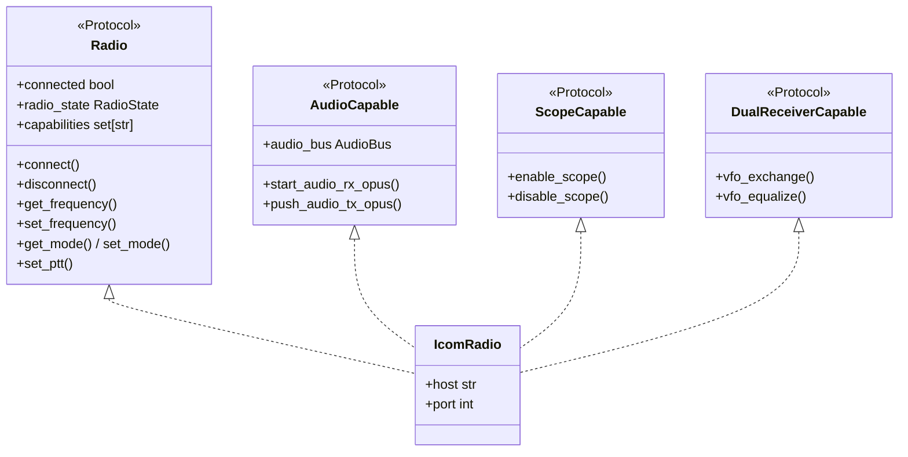

### `radio_state.py` — Live Radio State

`RadioState` dataclass holds the complete live state for both receivers plus global parameters. Populated continuously by `CivRxMixin` from incoming CI-V frames; served by `GET /api/v1/state`. Runs alongside the existing `StateCache` without replacing it.

- **`ReceiverState`**: per-receiver mutable state — `freq`, `mode`, `filter`, `data_mode`, `att`, `preamp`, `nb`, `nr`, `digisel`, `ipplus`, `af_level`, `rf_gain`, `squelch`, `s_meter`
- **`RadioState`**: top-level container — `main` + `sub` (`ReceiverState`), `ptt`, `power_level`, `split`, `dual_watch`, `active` ("MAIN" | "SUB")
- `to_dict()`: JSON-serializable snapshot (used by `/api/v1/state`)
- `receiver(which)`: returns `main` or `sub` by name string

### `radios.py` — Radio Model Registry

Static registry of known Icom models with their CI-V addresses and hardware capabilities. Prevents hard-coding model-specific values in `IcomRadio` and `rigctld`.

- **`RadioModel`**: frozen dataclass — `name`, `civ_addr`, `receivers`, `has_lan`, `has_wifi`
- **`RADIOS`**: `{"IC-7610": 0x98, "IC-7300": 0x94, "IC-705": 0xA4, "IC-9700": 0xA2, "IC-R8600": 0x96, "IC-7851": 0x8E}`
- **`get_civ_addr(model)`**: case-insensitive lookup; raises `KeyError` for unknown models

### `meter_cal.py` — Meter Calibration Tables

Converts raw BCD meter values (0–255) to calibrated engineering units using piecewise linear interpolation tables ported directly from wfview's `IC-7610.rig` file. No dependencies.

- **`MeterType`** (str Enum): `SMETER`, `POWER`, `SWR`, `ALC`, `COMP`, `CURRENT`, `VOLTAGE`
- **`calibrate(meter, raw)`** → `float`: linear interpolation through the matching table; returns `float(raw)` unchanged for unknown meter types
- Calibrated ranges: S-meter (−54 to +60 dBm), power (0–120 W), SWR (1.0–6.0), supply voltage (0–16 V)

### `scope.py` — Spectrum Scope Assembler

Reassembles multi-sequence CI-V `0x27/0x00` bursts into complete `ScopeFrame` objects. The IC-7610 splits each frame across up to 15 UDP packets at ~225 frames/sec; `ScopeAssembler` accumulates chunks per receiver with timeout-based partial-frame discard.

- **`ScopeAssembler`**: `feed(raw_payload, receiver)` → `ScopeFrame | None`; maintains independent state for main (0) and sub (1) receivers; center-mode frequency edge correction built in
- **`ScopeFrame`**: dataclass — `receiver`, `mode`, `start_freq_hz`, `end_freq_hz`, `pixels` (bytes 0–160 amplitude), `out_of_range`
- `_ReceiverState`: internal per-channel accumulator — resets on `seq=1`, emits on `seq=seqMax`, discards partials older than `assembly_timeout` (default 5 s)

### `scope_render.py` — Scope Image Rendering

Renders `ScopeFrame` data to PNG images using Pillow (optional `rigplane[scope]`). Provides spectrum (amplitude vs. frequency line chart) and waterfall (time × frequency heatmap) views with configurable color themes.

- **`render_spectrum(frame, width, height, theme)`** → PIL Image: frequency-labeled X axis, amplitude Y axis, filled line graph
- **`render_waterfall(frames, width, height, theme)`** → PIL Image: newest row at top; uses direct pixel access (`img.load()`) for ~10× speedup over `draw.point`
- **`render_scope_image(frames, …, output)`** → PIL Image: composite spectrum-on-top + waterfall-below; optionally saves PNG
- **`THEMES`**: `"classic"` (dark-blue → cyan → yellow → red) and `"grayscale"`; `amplitude_to_color(value, theme)` for per-pixel use

### `sync.py` — Synchronous API Wrapper

Thin blocking wrapper around async `IcomRadio` for use in scripts and REPL sessions. Runs a dedicated `asyncio` event loop internally; exposes the full async API as synchronous methods with context-manager support.

- **`IcomRadio`**: `with IcomRadio(host, …) as radio:` pattern — `__enter__` calls `connect()`, `__exit__` calls `disconnect()` and closes the event loop
- Mirrors all async methods: frequency, mode, power, meters, PTT, VFO, attenuator, audio, CW, state snapshot/restore
- Deprecated aliases (`start_audio_rx` → `start_audio_rx_opus`, etc.) emit `DeprecationWarning` with `stacklevel=2`

## Data Flow

### CI-V Command (GET)

```
radio.get_frequency()
  → commander.enqueue(priority=NORMAL)
  → build CI-V frame: FE FE 98 E0 03 FD
  → _civ_transport.send_tracked()
  → UDP → radio:50002
  → response arrives in _packet_queue
  → _civ_rx_loop drains queue → parse → match waiter → return
  → (on timeout: return cached value if available)
```

### CI-V Command (SET, fire-and-forget)

```
radio.set_frequency(14_074_000)
  → commander.enqueue(priority=NORMAL)
  → build CI-V frame: FE FE 98 E0 05 ... FD
  → _civ_transport.send_tracked()
  → UDP → radio:50002
  → (no wait for ACK — fire and forget)
```

### Scope Streaming

```
radio:50002 sends ~225 scope packets/sec
  → _civ_rx_loop drains ALL from queue each iteration
  → scope frames (cmd 0x27) → ScopeAssembler → callback
  → non-scope frames → routed to command waiters
  → (drain-all prevents scope flood from starving GET responses)
```

### High-Level Data Flow

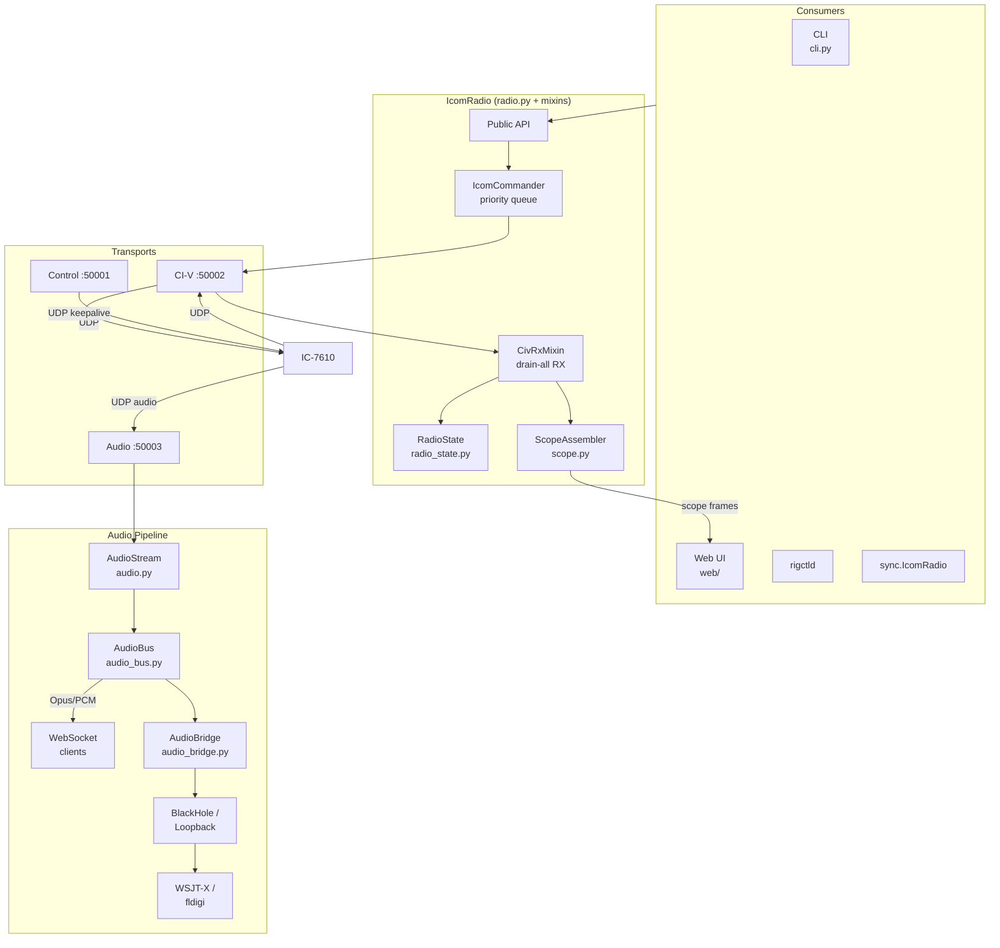

## Key Design Decisions

### Drain-All RX Pattern (#66)

The CI-V port receives mixed traffic: scope data (~225 pkt/sec), command responses,
unsolicited status updates. Processing one packet per iteration caused GET commands
to time out because responses waited behind hundreds of scope packets. The drain-all
pattern processes every queued packet each iteration, matching wfview's synchronous
`dataReceived()` approach.

### Soft Reconnect

The Web UI's Connect/Disconnect button uses a two-tier reconnect strategy:

1. **Soft disconnect** (`soft_disconnect()`) — closes CI-V and audio transports but
   keeps the control transport alive (pings continue). The radio maintains the session.
2. **Soft reconnect** (`soft_reconnect()`) — re-opens only the CI-V transport using
   the existing control session. No discovery, no login, no conninfo — just CI-V open.
   Takes ~1 second vs 30-60s for a full reconnect.
3. **Fallback** — if the control transport died, falls back to full `connect()`.

This mirrors how wfview handles temporary CI-V interruptions without tearing down
the entire session.

### Optimistic Port Connection

Icom radios use fixed port offsets (control+1 for CI-V, control+2 for audio).
Instead of blocking on the status packet (which returns `civ_port=0` after rapid
reconnects), we connect immediately to default ports and verify asynchronously.

### Fire-and-Forget SET Commands (#56)

SET commands (frequency, mode, power, PTT) don't need ACK confirmation for
normal operation. Waiting for ACK under scope flood caused cascading timeouts.
GET commands still wait (with cache fallback), matching wfview's behavior.

### Mixin Pattern (#60)

`radio.py` was split using Python mixins to keep the public API surface unchanged
while separating concerns. `IcomRadio` inherits from `ControlPhaseMixin`,
`CivRxMixin`, and `AudioRecoveryMixin`. Cross-mixin access uses
`self._xxx  # type: ignore[attr-defined]` — accepted trade-off for zero API breakage.

## Dependencies

```
rigplane (runtime, core install — since v0.19)
├── pyserial, pyserial-asyncio (CI-V serial transport)
├── sounddevice (PortAudio bindings — virtual-audio bridge, USB audio devices)
├── numpy (PCM frame processing, DSP)
└── opuslib (Opus codec for decode/encode)

rigplane[dev]
├── pytest, pytest-asyncio, pytest-cov, pytest-timeout
├── ruff, mypy

rigplane[scope]
└── Pillow (for scope image rendering)

rigplane[dsp]
└── scipy (advanced DSP — anti-aliasing FIR filter design, etc.)

rigplane[webrtc]
└── aiortc (WebRTC audio transport)

rigplane[tls]
└── cryptography (auto-generated HTTPS certs)

rigplane[audio]   # no-op alias preserved for backwards compat (#1090)
rigplane[bridge]  # no-op alias preserved for backwards compat (#1090)
```

## High-Level Flows

### Control: CLI → Radio → CI-V → IC-7610

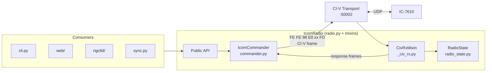

### Audio: IC-7610 → AudioBus → [WebSocket, Bridge → BlackHole → WSJT-X]

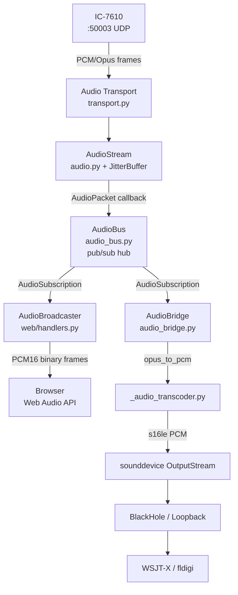

### Scope: IC-7610 → ScopeAssembler → WebSocket

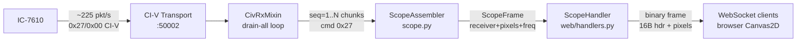

## Module Data Flow Diagrams

### `audio.py` — AudioStream State Machine

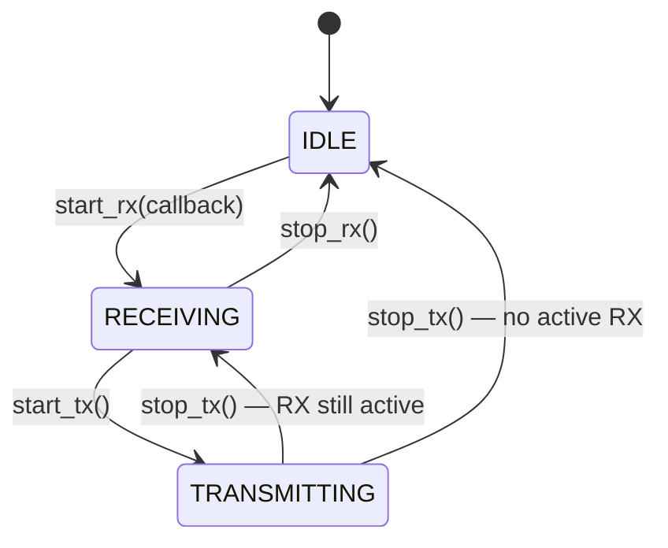

RX data path through `JitterBuffer`:

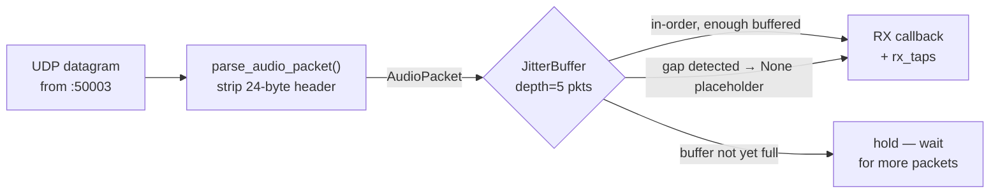

### `_audio_transcoder.py` — Backend Abstraction

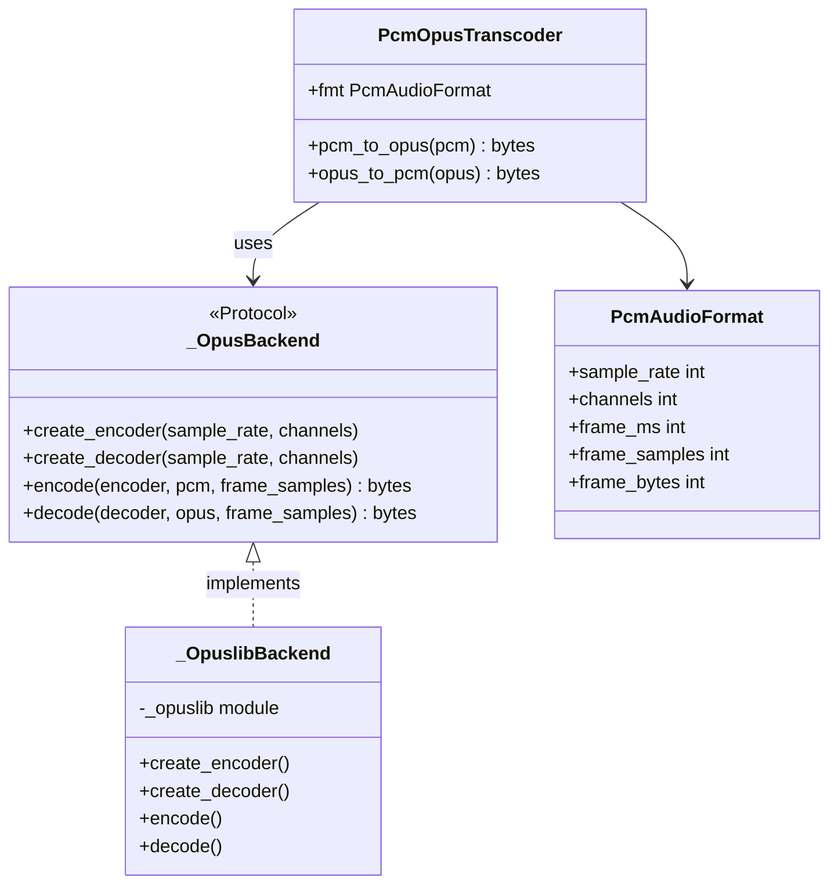

### `civ.py` — CI-V Request Lifecycle

GET command (awaited future):

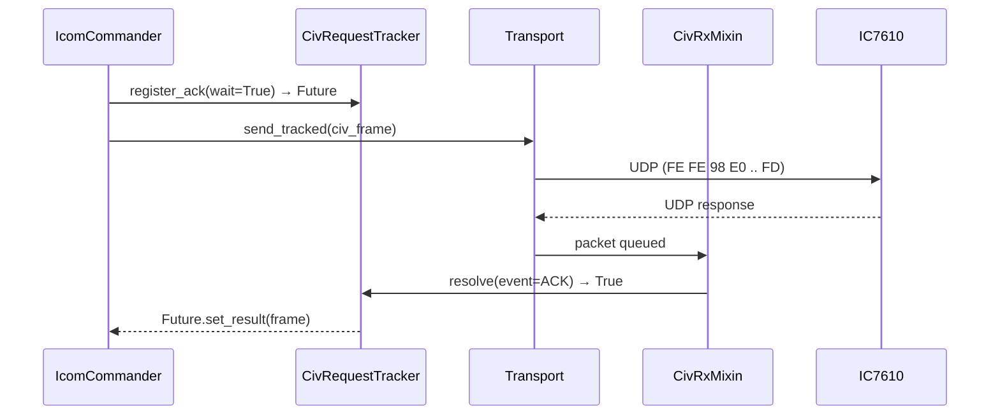

SET command (fire-and-forget):

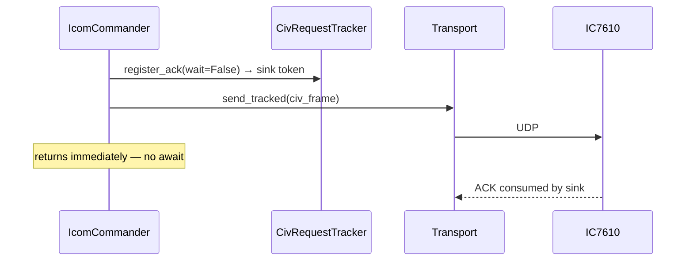

### `exceptions.py` — Exception Hierarchy

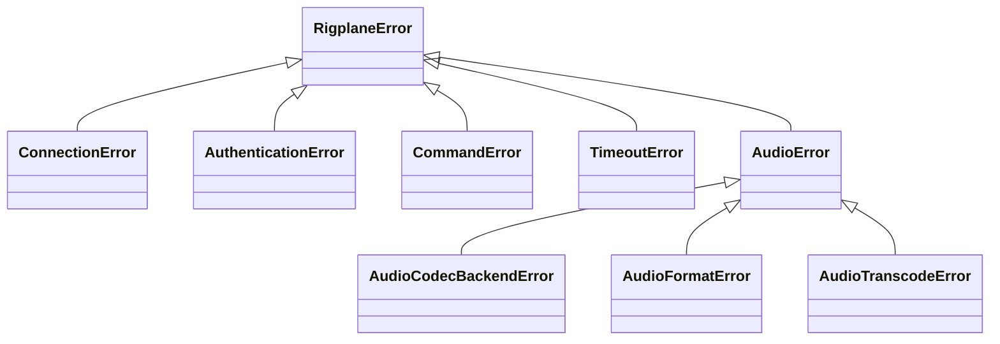

### `meter_cal.py` — SWR Interpolation

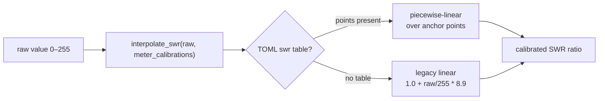

Calibration tables are sourced exclusively from per-rig TOML
(`rigs/*.toml` `[[meters.<name>.calibration]]`) and reach this helper via
`RadioProfile.meter_calibrations`.

### `protocol.py` — Packet Header I/O

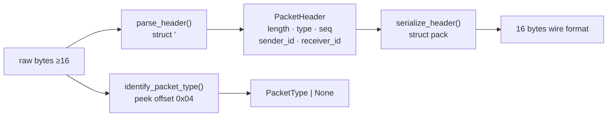

### `proxy.py` — UDP Relay Flow

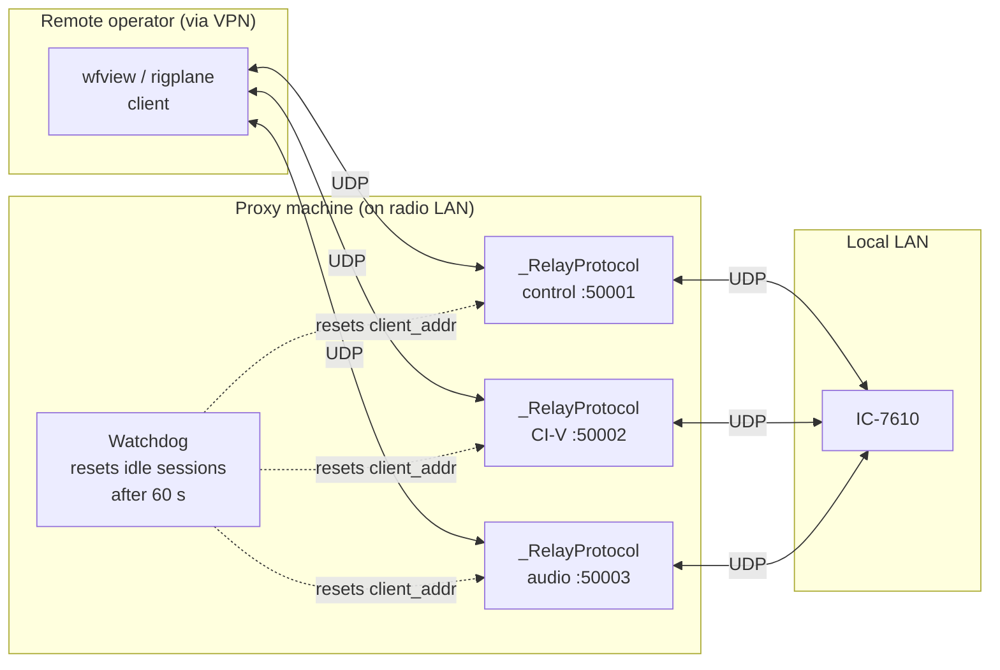

### `radio_state.py` — Live State Model

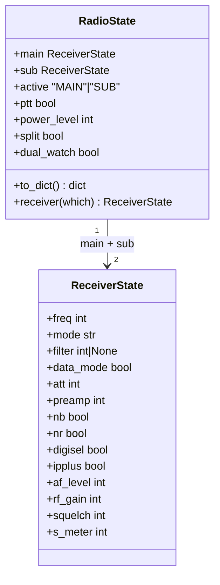

Update flow (CI-V frames → live state → consumers):

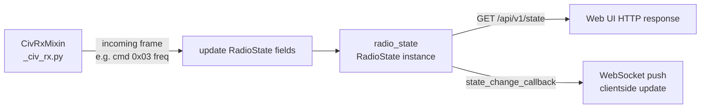

### `radios.py` — Model Registry

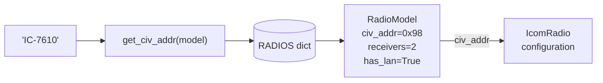

### `scope.py` — Multi-Packet Assembly

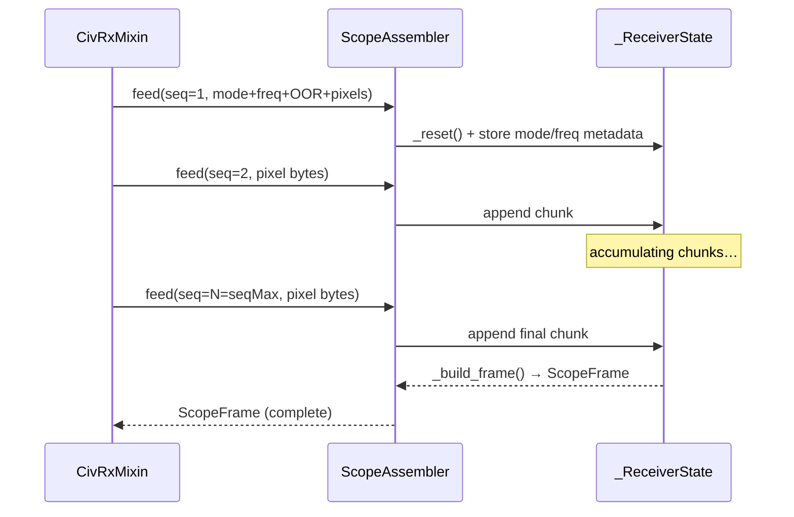

Center-mode frequency correction (built into `_ReceiverState.feed`):

```
seq=1 payload → start_freq=center, end_freq=bandwidth
→ corrected: start = center − bw, end = center + bw
```

### `scope_render.py` — Rendering Pipeline

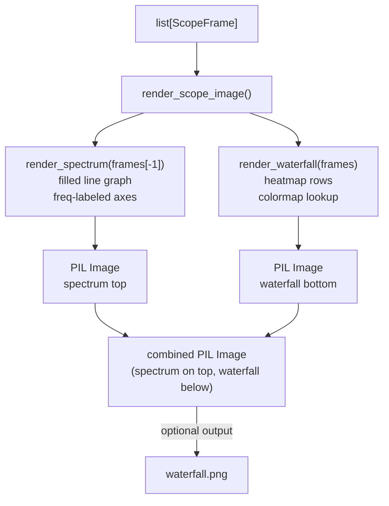

### `sync.py` — Synchronous Event-Loop Wrapper

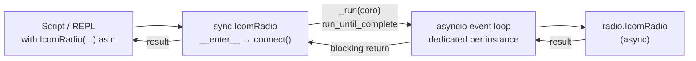

### `types.py` — BCD Frequency Encoding

```mermaid
flowchart LR
    Hz["14_074_000 Hz"] -->|bcd_encode| BCD["bytes: 00 40 07 14 00\n5-byte little-endian BCD"]
    BCD -->|bcd_decode| Hz2["14_074_000 Hz"]
```

BCD byte layout for `14_074_000` Hz:

```
Decimal string: "0014074000"   (10 digits, most-significant first)
byte[0] = 0x00  → units+tens          = 00
byte[1] = 0x40  → hundreds+thousands  = 40  (0×10² + 4×10³ = 4000)
byte[2] = 0x07  → 10k+100k           = 07  (0×10⁴ + 7×10⁵ = 70000)
byte[3] = 0x14  → 1M+10M             = 14  (4×10⁶ + 1×10⁷ = 14000000)
byte[4] = 0x00  → 100M+1G            = 00
```
