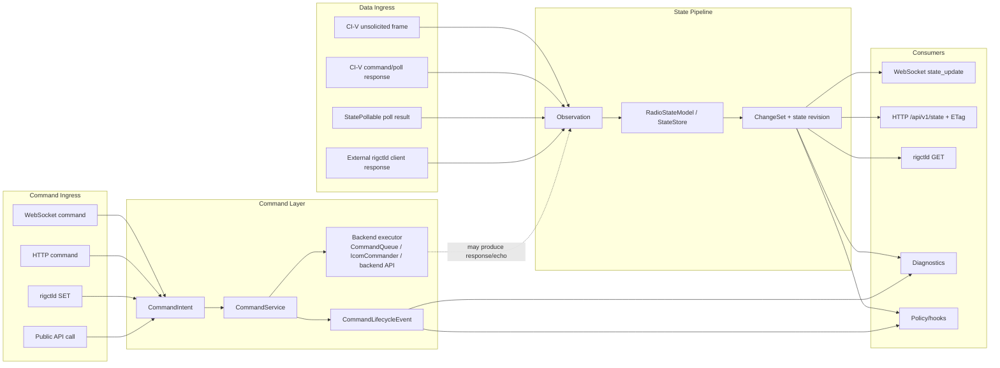
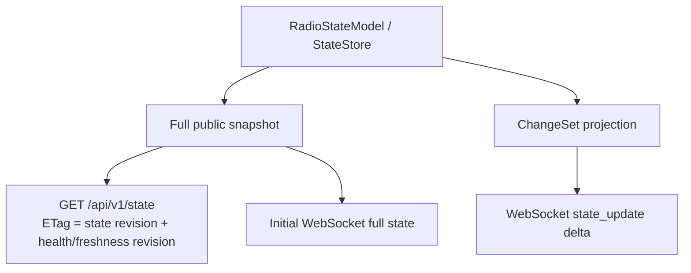
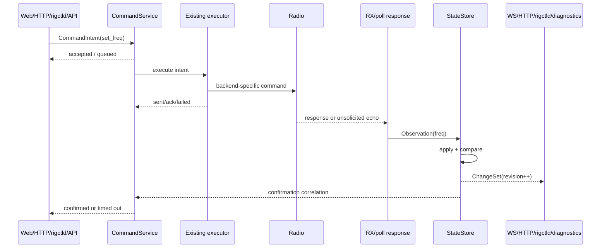

# Radio State Pipeline Design

Status: draft for review
Date: 2026-06-02
Scope: public open-core runtime, web, rigctld, and backend-neutral state flow

## Summary

RigPlane needs one canonical radio state model. WebSocket, HTTP snapshots,
rigctld reads, diagnostics, and future processing hooks should all consume the
same state source, with one state revision sequence and separate freshness
versioning. Polling, push frames, command responses, and adaptive acquisition
are ways to discover values; they must not be delivery pipelines.

The target architecture separates command ingress from data ingress:

```text
Command ingress:
  WebSocket / HTTP / rigctld / public API
    -> CommandIntent
    -> backend-neutral CommandService
    -> backend executor / existing command queue / IcomCommander

Data ingress:
  CI-V push / command response / poll response / Yaesu poller / Hamlib rigctld client
    -> Observation
    -> StateStore.apply(...)
    -> ChangeSet + revision

Consumers:
  WebSocket / HTTP state / rigctld GET / diagnostics / future hooks
```

The first delivery milestone should introduce the neutral contracts and migrate
the highest-impact Icom/Web path. Later milestones should bring Yaesu,
Hamlib/external-rigctld, rigctld SET/GET, and adaptive policy hooks onto the
same model.

## Problem Statement

The current command execution system is reliable and should remain intact. The
fragile area is the pipeline from "a value was received from the radio" to "all
consumers observe the same state".

Current symptoms:

- S-meter and other meters can update in `RadioState` without consistently
  advancing the public web revision. The UI then sees meters in bursts when an
  unrelated event advances the revision.
- X6200 can show multi-second lag after tuning from the radio panel. IC-7610
  LAN often masks the same architectural weakness with faster transport and
  richer unsolicited state.
- WebSocket and HTTP both update the frontend store, but they do not currently
  share a canonical state revision owned by the state model.
- rigctld maintains local pending/cache state for some operations instead of
  consuming the same radio state source as Web.
- Radio-specific workarounds are tempting because acquisition policy and state
  delivery are not cleanly separated.

## Goals

- Make the radio state model the single source of truth for confirmed radio
  state and canonical state revision.
- Ensure every meaningful state mutation is represented as a typed `ChangeSet`.
- Treat WebSocket and HTTP as two representations of the same state source.
- Treat rigctld GET as a consumer of the same state source.
- Preserve the existing command queue, IcomCommander, transport pacing, raw
  CI-V transaction ownership, and backend safety behavior.
- Represent writes as `CommandIntent` lifecycle events, not as direct state
  delivery.
- Support optional pending state for local writes without confusing it with
  confirmed observations from the radio.
- Make radio-specific behavior capability/policy-driven rather than
  backend-name branches.
- Provide explicit hooks for diagnostics, pulse/adaptive polling, meter
  coalescing, and future public processing.

## Non-Goals

- Do not replace the existing serialized command executors in the first
  milestone.
- Do not introduce direct `libhamlib` bindings. Core's Hamlib boundary remains
  external `rigctld`.
- Do not change rigctld wire protocol behavior.
- Do not redesign the frontend UI.
- Do not add proprietary, hosted-account, customer-specific, or Pro-only
  workflow logic to Core.

## Current Model

### Web State Delivery

The frontend currently starts HTTP polling for `/api/v1/state`, then opens the
control WebSocket. Both channels write into the same frontend store.

HTTP polling only calls the store callback when `revision` or
`healthRevision` advances. The control WebSocket receives `state_update`
messages and also writes to the store. This is operationally useful, but the
backend revision is not owned by the radio state model.

### Icom CI-V State Updates

The CI-V RX path decodes solicited and unsolicited frames and mutates state.
Only selected fields call a state-change callback. Some high-value fields such
as meters and frequency/mode are updated silently or through separate paths.

That creates this failure mode:

```text
meter frame arrives
  -> RadioState meter field changes
  -> no state revision bump
  -> no Web state broadcast
  -> later unrelated event bumps revision
  -> UI receives several meter changes as one jump
```

### SET Commands

WebSocket commands and HTTP commands mostly enter the Web `CommandQueue`, then
the poller executes them through the backend API. Some commands also apply
manual optimistic updates to `RadioState` and bump a poller-owned revision.

rigctld SET commands currently call backend methods directly and maintain local
pending/cache values for some fields. This is a separate command ingress path
and a separate read cache.

## Target Architecture



### Core Concepts

#### RadioStateModel / StateStore

The state model owns the canonical `RadioState` instance and the canonical
state revision. It is the only layer that applies observations to confirmed
state.

Responsibilities:

- Validate and normalize field updates.
- Compare previous and next values.
- Emit `ChangeSet` only when confirmed state changes.
- Keep one monotonic state revision for applied model snapshots. This revision
  is a local version/cache-invalidation sequence, not proof that the physical
  radio has not changed.
- Provide full snapshots for HTTP and initial WebSocket state.
- Provide optional projections for rigctld and diagnostics.
- Track per-field freshness metadata: last observation time, source,
  confidence, max age, and stale/unknown status.
- Maintain health/freshness revision separately from value revision for
  validity changes that do not alter a data value.

The implementation should avoid web or rigctld imports. Contracts should live
in a neutral layer; the concrete runtime object can be wired into Web and
rigctld at startup.

#### Observation

An `Observation` is a decoded value from an acquisition source. It is not a
command acknowledgement and not a Web event.

Suggested fields:

- `path`: typed state path, such as `main.freq`, `main.s_meter`,
  `power_meter`, `ptt`.
- `value`: normalized Python value.
- `source`: `civ_unsolicited`, `poll_response`, `command_response`,
  `state_poller`, `hamlib_response`, `local_reconcile`.
- `receiver`: optional receiver identity.
- `timestamp_monotonic`.
- `quality`: optional flags such as `confirmed`, `stale`, `partial`,
  `synthetic`.
- `correlation_id`: optional command intent or poll request id.

Observation hooks should fire for every decoded sample, even if the value did
not change. This supports diagnostics and policy decisions such as "radio is
alive" and "meter sample rate".

#### ChangeSet

A `ChangeSet` is the result of applying one or more observations to the state
model.

Suggested fields:

- `revision`: canonical state revision after the change.
- `changes`: typed field changes with previous and next values.
- `timestamp_monotonic`.
- `sources`: acquisition sources represented in this change set.
- `coalesced`: whether multiple observations were batched.

Change hooks fire only when confirmed state changes. WebSocket deltas, HTTP
ETags, rigctld GET cache invalidation, and diagnostics should derive from this
event.

#### Revision, Freshness, and Missed Events

State revision answers only this question: "has the model applied a newer known
state value?" It must not be interpreted as "the radio definitely did not
change."

If an unsolicited radio frame is lost, malformed, or never emitted by the radio,
the model cannot infer the missing value change from revision alone. The system
therefore also needs field freshness and reconciliation:

- Each state field or field family tracks `last_observed_monotonic`, source,
  confidence, and a policy-defined freshness window.
- Freshness transitions, such as `fresh -> stale` or `unknown -> fresh`, emit a
  health/freshness event and may advance a separate freshness revision.
- Consumers that need authoritative state can call an `ensure_fresh(paths,
  max_age)` style API. That API may return the current fresh value, trigger an
  acquisition read, or report stale/unavailable state.
- Critical fields such as frequency, mode, PTT, power state, and selected
  receiver need reconciliation polling even when push is supported.
- Meter fields can have shorter freshness windows and coalesced delivery, but
  the latest sample must still be tracked independently from Web delivery rate.

This keeps revision useful for transport deltas while preventing it from
becoming a false correctness signal.

#### CommandIntent

A `CommandIntent` represents an attempt to change or query radio state from a
consumer.

Suggested fields:

- `id`: stable command id.
- `name`: backend-neutral operation name, such as `set_freq`.
- `params`: normalized command parameters.
- `source`: `websocket`, `http`, `rigctld`, `public_api`, `internal_policy`.
- `target`: receiver/VFO/global target.
- `priority`: user, normal, background.
- `timeout`.
- `pending_policy`: whether the command should create a pending local overlay.
- `expected_observations`: optional fields likely to confirm the command.

Command lifecycle events are separate from state changes:

- `accepted`
- `queued`
- `sent`
- `acknowledged`
- `failed`
- `timed_out`
- `confirmed`
- `superseded`

#### Pending State

For user experience and rigctld compatibility, some writes need immediate
read-after-write behavior. This should be represented as pending intent, not as
confirmed radio state.

Example:

```text
CommandIntent(set_freq=14074000, source=rigctld)
  -> pending overlay: main.freq=14074000, confirmed=false
  -> CI-V observation: main.freq=14074000
  -> confirmed state change, pending cleared
```

The public state schema can remain backward compatible by continuing to expose
plain values. Additive metadata can expose pending/confirmed status later if
needed. Internally, consumers must be able to distinguish confirmed state from
local intent.

### Acquisition Policy

Acquisition policies decide how values are obtained. They do not own state
delivery.

Examples:

- Prefer CI-V unsolicited frames when a backend/profile supports them.
- Run low-rate reconciliation reads for critical state even when push is
  supported, because unsolicited frames can be missed.
- Poll frequency/mode on a short pulse after local writes or detected external
  activity when unsolicited updates are unavailable.
- Trigger `ensure_fresh` reads when a consumer requires data newer than the
  field's freshness window.
- Poll S-meter at a profile-safe target rate.
- Poll TX meters more aggressively while transmitting.
- Slow down background state queries when the link is idle or congested.
- Reduce background telemetry before delaying user commands.

Policy decisions should be capability-driven:

- transport type and safe minimum gap
- profile meter support
- unsolicited frequency/mode support
- unsolicited meter support
- command response semantics
- serial backpressure/error rate
- external CAT session ownership

No policy should branch directly on a model name such as X6200 unless the model
profile exposes that capability or constraint.

### Hooks

The architecture should expose these hook categories:

- `on_command(event)`: command lifecycle, audit, latency, failure analysis.
- `on_observation(observation)`: raw sample accounting and acquisition policy.
- `on_change(changeset)`: canonical state revision, delivery, history.
- `on_policy_signal(signal)`: pulse/adaptive scheduling, backpressure, mode
  changes such as RX/TX.

Hooks must not mutate `RadioState` directly. They may enqueue acquisition work,
emit diagnostics, update metrics, or request command execution through the
command service.

## HTTP and WebSocket Representation

HTTP and WebSocket must become projections of the same `RadioStateModel`.



Rules:

- Initial WebSocket state and HTTP snapshot come from the same snapshot builder.
- HTTP ETag uses the canonical state revision plus health/freshness revision.
- WebSocket `state_update.revision` uses the canonical state revision.
- No state revision advance means "the model has no newer applied value"; it
  does not prove the physical radio did not change.
- Any transport-local sequence, if needed, should be a separate field and not
  the state revision.
- Delta encoding is a representation concern. It must not own canonical state
  revision.
- HTTP ETags include state revision plus health/freshness revision so stale
  transitions can be observed even when values do not change.
- HTTP polling can remain as a startup/fallback edge case, but it is not a
  second source of truth.

## Command Flow



Important separation:

- Command acceptance does not imply confirmed state.
- Fire-and-forget command execution may still create pending local intent.
- Confirmed state changes only through observations or explicit local
  reconciliation events.
- Failed commands clear or expire pending overlays without creating confirmed
  state.

## Backend Coverage

### Icom CI-V

Icom is the first high-impact migration path because it already has an RX pump
that can decode unsolicited frames and poll responses.

Required changes in the Icom path:

- Convert decoded CI-V frames into observations for all state-bearing frames,
  including frequency, mode, meters, PTT, power, DSP flags, and levels.
- Preserve raw CI-V transaction ownership and request tracking.
- Keep IcomCommander and serial/LAN pacing.
- Mark poller-originated queries as acquisition work, not state delivery work.
- Use background priority and dedupe for background acquisition where possible.

### StatePollable Backends

Backends that expose request-response polling should publish observations from
their polling results. The existing poller can remain as the acquisition
mechanism.

### Hamlib External rigctld Provider

Core's Hamlib boundary remains an external `rigctld` process. The Hamlib client
backend should translate rigctld responses into observations and expose
capabilities that describe whether useful push/notification behavior is
available.

### rigctld Server

rigctld GET should read from the shared state model. rigctld SET should become
command ingress into `CommandService`, or at minimum publish command intents and
pending overlays while still using the existing backend method path during
migration.

## Milestones

### Milestone 0: Evidence and Diagnostics

Deliverables:

- Counters for observations by source and field family.
- Counters for `ChangeSet` emission by field family.
- Counters for stale/fresh transitions by field family.
- Counters for reconciliation reads and `ensure_fresh` calls.
- Broadcast counters for WebSocket and HTTP ETag revision changes.
- Command queue latency and executor latency metrics.
- Serial partial-frame, timeout, and backpressure metrics.

Acceptance:

- It is possible to compare meter frame ingress rate with Web/UI state delivery
  rate.
- It is possible to determine whether X6200 emits unsolicited frequency frames
  during VFO tuning.
- It is possible to determine whether reconciliation corrected a missed or
  stale field.
- No behavior changes are required in this milestone.

### Milestone 1: Core Contracts and StateStore

Deliverables:

- Backend-neutral `Observation`, `ChangeSet`, `CommandIntent`, and
  `CommandLifecycleEvent` contracts.
- `RadioStateModel` / `StateStore` implementation with canonical revision.
- Per-field freshness metadata and separate freshness/health revision semantics.
- Snapshot projection for the existing public state schema.
- Hook registration for observation/change/command/policy events.
- Unit tests for revision behavior, no-op applies, receiver paths, and
  coalesced changes.

Acceptance:

- Applying a changed observation increments state revision exactly once.
- Applying an unchanged observation does not increment state revision.
- Freshness-only transitions do not fake data changes, but they are visible to
  consumers through freshness/health revision.
- Full snapshots match the existing public state contract.
- No Web or rigctld imports are introduced into core/runtime state modules.

### Milestone 2: Icom RX and Web State Migration

Deliverables:

- Icom CI-V RX path emits observations for frequency, mode, meters, and existing
  notify-backed fields.
- Icom poll responses feed the same observation path.
- Web HTTP snapshot and initial WebSocket full state are built from
  `StateStore`.
- WebSocket deltas use canonical state revision.
- Meter changes are coalesced for Web delivery at a bounded rate.

Acceptance:

- S-meter changes advance state revision or are included in bounded coalesced
  revisions.
- Frequency changes from unsolicited CI-V frames reach Web without waiting for
  unrelated events.
- If an unsolicited frequency/mode event is missed, a reconciliation read can
  eventually correct the shared state.
- HTTP `/api/v1/state` and WebSocket initial state agree on revision and data.
- Existing command execution behavior remains compatible.

### Milestone 3: Backend-Neutral Acquisition Adapters

Deliverables:

- `StatePollable` adapters publish observations instead of direct Web
  callbacks.
- Yaesu request-response polling updates the shared state model.
- External Hamlib/rigctld client backend responses update the shared state
  model.
- Capability/policy metadata describes push support, safe poll rates, meter
  support, freshness windows, reconciliation intervals, and transport
  constraints.

Acceptance:

- Web and HTTP do not need backend-specific state delivery code.
- Backend differences are represented through capabilities and acquisition
  policies.
- No model-specific X6200 branch is required for the general state pipeline.

### Milestone 4: rigctld Consumer Migration

Deliverables:

- rigctld GET reads from shared state snapshots/projections where freshness is
  acceptable.
- rigctld fallback reads still produce observations when they hit the radio.
- rigctld SET publishes command intents and pending overlays.
- Existing rigctld wire responses remain compatible with Hamlib clients.

Acceptance:

- Web and rigctld see consistent frequency/mode/meter state after the same radio
  observation.
- rigctld read-after-write behavior is preserved through pending intent or
  confirmed state.
- Local rigctld caches are either removed or reduced to compatibility shims.

### Milestone 5: Unified CommandService

Deliverables:

- WebSocket, HTTP, rigctld, and public API write paths enter a backend-neutral
  `CommandService`.
- Existing command queues/executors remain as backend execution adapters.
- Command lifecycle events are observable.
- Pending overlays are correlated with observations and cleared on
  confirmation, supersession, timeout, or failure.

Acceptance:

- Command ingress is consistent across Web, HTTP, rigctld, and public API.
- Command success/failure is not confused with confirmed state mutation.
- User-facing commands can preempt background acquisition on slow transports.

### Milestone 6: Adaptive Acquisition Policies

Deliverables:

- Frequency/mode pulse policy for radios without reliable unsolicited updates.
- Low-rate reconciliation policy for critical state even when push is available.
- Meter telemetry policy separated from slow state polling.
- TX-aware meter policy for POWER/ALC/SWR/COMP.
- Idle decay policy for background state queries.
- Backpressure policy that reduces background telemetry before delaying user
  commands.

Acceptance:

- X6200-like serial radios can use short freq/mode pulse polling without
  increasing all background traffic.
- Push-capable radios still recover from missed critical-state events through
  bounded reconciliation.
- Meters have stable, bounded delivery cadence appropriate to transport
  capability.
- Policy behavior is configured through capabilities/profile metadata, not
  hard-coded model branches.

### Milestone 7: Cleanup and Compatibility Hardening

Deliverables:

- Remove or deprecate poller-owned public state revision.
- Remove duplicate state caches where replaced by the shared state model.
- Update docs for Web, rigctld, state pipeline, and backend capabilities.
- Add regression tests for known meter and X6200 frequency-lag scenarios.

Acceptance:

- One canonical state revision remains for Web/HTTP state.
- No stale silent mutation path exists for supported state fields.
- Public API, Web state schema, and rigctld wire behavior remain compatible or
  any additive changes are documented.

## Coalescing and Rate Limits

The state model should emit canonical changes. Transports may coalesce delivery
for high-rate fields.

Guidelines:

- Frequency/mode changes should be delivered with minimal coalescing.
- Meter delivery to Web should be bounded, for example 20-30 Hz on capable
  links and lower on slow serial links.
- Observation hooks may see every sample even when Web delivery is coalesced.
- Coalescing must not hide the last value in a burst.
- Backpressure must drop or merge background telemetry before user-visible
  command lifecycle events.

## Error Handling

- Failed commands emit lifecycle failure events and clear relevant pending
  overlays.
- Timed-out pending overlays expire and may trigger reconciliation polling.
- Reconnect marks stale fields and may reset transport-local policy state.
- Missing expected observations do not silently confirm intent. They expire the
  pending overlay and may trigger targeted reconciliation.
- External CAT/raw CI-V ownership remains exclusive; acquisition policies pause
  when required by the existing ownership mechanism.
- Malformed or partial frames become diagnostics observations or counters, not
  state mutations.
- Health revision remains separate from state revision, but HTTP ETags include
  state, health, and freshness revision inputs.

## Testing Strategy

Unit tests:

- `StateStore.apply` increments revision only on real changes.
- No-op observations do not emit `ChangeSet`.
- Meter observations can be coalesced without losing latest values.
- Pending overlays confirm, expire, and supersede correctly.
- Freshness transitions are observable without changing confirmed values.
- `ensure_fresh` returns fresh cached values, triggers acquisition for stale
  values, and reports unavailable state when acquisition fails.
- Snapshot projection matches the existing public state schema.

Icom tests:

- CI-V `0x15` meter frames produce observations and state changes.
- CI-V `0x00`/`0x03` frequency frames produce observations and state changes.
- Poll responses and unsolicited frames use the same apply path.
- Reconciliation reads correct stale or missed frequency/mode observations.
- Background acquisition uses priority/dedupe where supported.

Web tests:

- Initial WebSocket full state and HTTP `/api/v1/state` are generated from the
  same state revision.
- WebSocket deltas use canonical state revision.
- HTTP ETag advances when state revision advances.
- HTTP ETag or equivalent freshness token advances when critical fields become
  stale even if values do not change.

rigctld tests:

- GET frequency/mode reads shared state when fresh.
- SET frequency creates command intent and preserves read-after-write behavior.
- Fallback radio reads publish observations.
- GET paths can request fresh-enough values instead of trusting indefinitely
  stale state.

Integration/fake-backend tests:

- X6200-like serial profile shows bounded frequency update latency after VFO
  tuning when unsolicited frames are present.
- X6200-like no-push profile uses pulse polling without flooding background
  state queries.
- Meter delivery cadence is stable and bounded.

## Open Decisions

- Exact module placement for contracts and implementation must satisfy the
  import-linter layer matrix. The preferred split is neutral contracts in core
  and runtime orchestration in runtime.
- Public exposure of pending metadata should be additive and may be deferred.
- The exact Web meter delivery rate should be profile/policy driven after
  diagnostics establish realistic serial and LAN rates.
- The command confirmation timeout policy should differ by command family and
  transport.

## Review Checklist

- The radio state model is the only canonical source of state revision.
- WebSocket and HTTP are representations of the same state source.
- Pollers acquire observations; they do not own state delivery.
- rigctld is both command ingress and state consumer.
- Radio-specific behavior is modeled as capabilities/policy.
- Existing command serialization and raw CI-V ownership are preserved.
